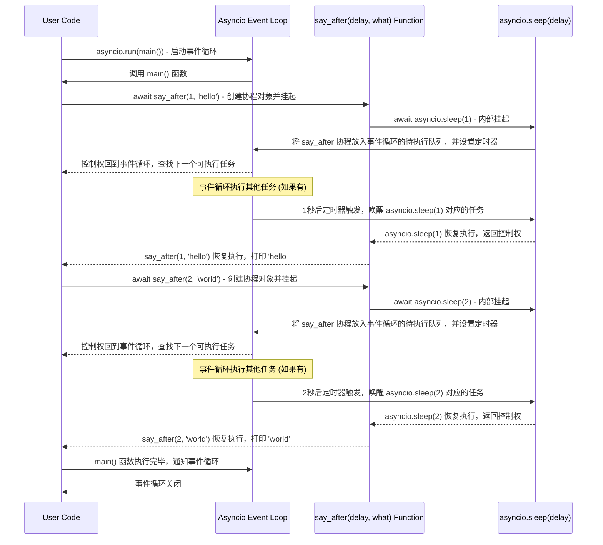
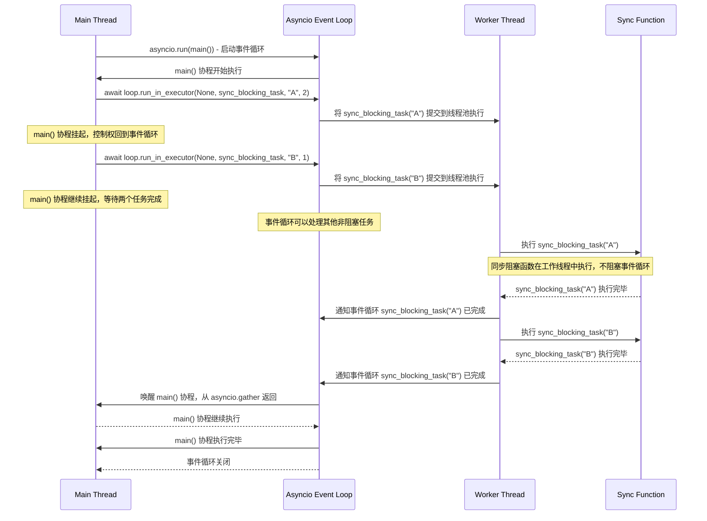
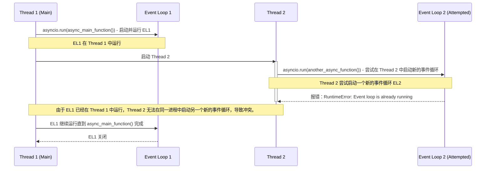
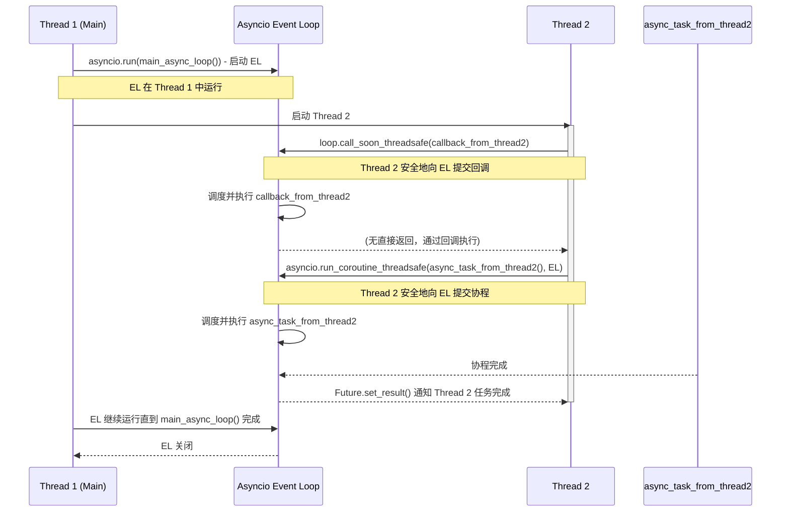
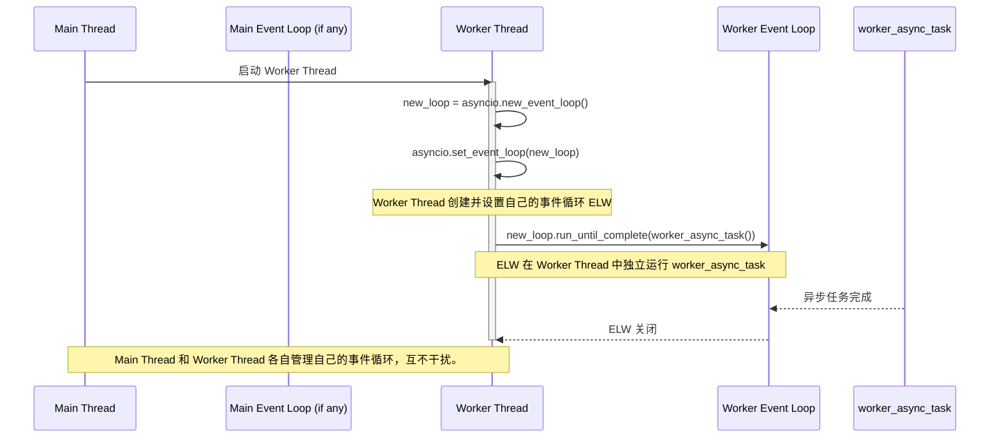
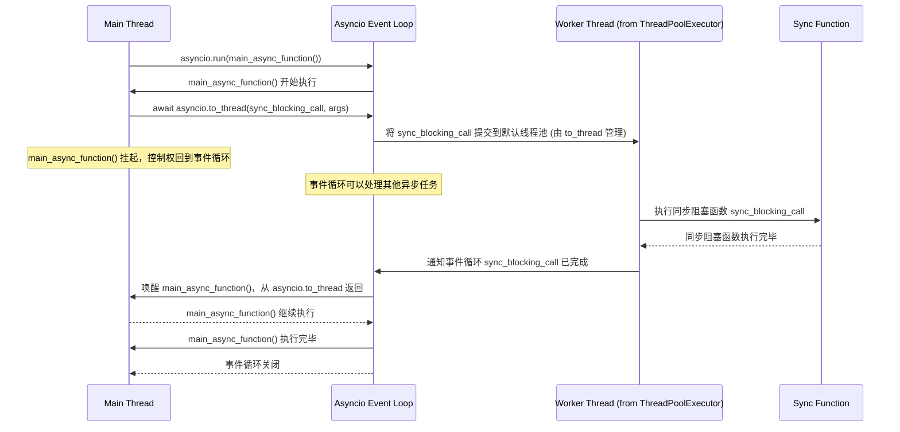

# Python asyncio Eventloop 控制逻辑研究

## 1. asyncio 异步执行上下文、代码控制权流转及任务完成通知

在 `asyncio` 中，异步程序的执行并非像传统同步程序那样从上到下顺序执行。它的核心在于事件循环（Event Loop），事件循环负责调度协程（Coroutines）的执行。当一个协程遇到 `await` 表达式时，它会暂停执行并将控制权交还给事件循环，事件循环则可以去执行其他准备好的任务。当被 `await` 的操作完成后，事件循环会重新调度之前暂停的协程，使其从暂停的地方继续执行。

### 示例代码

以下是您提供的 `demo` 代码，我们将以此为例进行分析：

```python
import asyncio
import time

async def say_after(delay, what):
    await asyncio.sleep(delay)
    print(what)


async def main():
    print(f"started at {time.strftime('%X')}")

    await say_after(1, 'hello')
    await say_after(2, 'world')

    print(f"finished at {time.strftime('%X')}")

asyncio.run(main())
```

### 时序图：异步执行上下文与控制流

下图展示了上述 `demo` 代码在 `asyncio` 事件循环中的执行流程，以及代码控制权的流转：



**要点解释：**

*   **`asyncio.run(main())`**：这是进入 `asyncio` 异步执行上下文的入口点。它会启动一个新的事件循环，并运行 `main()` 协程直到完成。如果当前线程已经有一个事件循环在运行，再次调用 `asyncio.run()` 会报错，这是事件循环冲突的一个典型表现。
*   **`await say_after(...)`**：当 `main` 协程遇到 `await say_after` 时，它会创建一个 `say_after` 协程对象。由于 `say_after` 内部有 `await asyncio.sleep(delay)`，`say_after` 协程会立即暂停执行，并将控制权交还给事件循环。此时，事件循环可以自由地执行其他任务。
*   **`await asyncio.sleep(delay)`**：这是一个非阻塞的等待操作。它不会阻塞整个事件循环，而是告诉事件循环：“我需要等待 `delay` 秒，在这期间你可以去执行其他任务”。当 `delay` 时间到期后，事件循环会重新唤醒 `asyncio.sleep` 协程。
*   **控制权流转**：从时序图中可以看到，当协程遇到 `await` 时，控制权会从协程交还给事件循环。事件循环负责调度下一个准备好的协程继续执行。当被 `await` 的操作完成后，事件循环会“通知”之前挂起的协程，让它从挂起的地方继续执行。
*   **任务完成通知**：`asyncio` 内部通过 Future 和 Task 机制来管理协程的状态和结果。当 `asyncio.sleep` 完成后，它会标记对应的 Future 为“完成”，事件循环会检测到这个状态变化，然后重新调度 `say_after` 协程继续执行。


## 2. asyncio 中多线程异步代码执行的代码控制权流程

在 `asyncio` 中，事件循环是单线程的。这意味着所有的协程都在同一个线程中执行。但是，有时我们需要执行一些耗时的同步阻塞操作（例如文件I/O、网络请求或者CPU密集型计算），如果直接在事件循环线程中执行这些操作，会导致事件循环被阻塞，从而影响整个程序的响应性。

为了解决这个问题，`asyncio` 提供了 `loop.run_in_executor()` 方法，可以将同步阻塞操作提交到一个单独的线程池或进程池中执行。这样，耗时操作在后台线程中执行，而事件循环可以继续处理其他协程，从而保持非阻塞性。

### 简要示例代码

```python
import asyncio
import time
import concurrent.futures

def sync_blocking_task(name, duration):
    print(f"同步任务 {name} 开始执行，耗时 {duration} 秒...")
    time.sleep(duration)
    print(f"同步任务 {name} 执行完毕。")
    return f"任务 {name} 完成"

async def main():
    loop = asyncio.get_running_loop()
    print(f"主协程开始执行于 {time.strftime('%X')}")

    # 在默认的线程池中运行同步阻塞任务
    task1 = loop.run_in_executor(None, sync_blocking_task, "A", 2)
    task2 = loop.run_in_executor(None, sync_blocking_task, "B", 1)

    results = await asyncio.gather(task1, task2)
    print(f"所有任务完成，结果：{results}")

    print(f"主协程结束执行于 {time.strftime('%X')}")

if __name__ == "__main__":
    asyncio.run(main())
```

### 时序图：多线程异步代码控制权流程



**要点解释：**

*   **`loop.run_in_executor(None, sync_blocking_task, ...)`**：这个方法是 `asyncio` 处理阻塞I/O和CPU密集型操作的关键。它接收一个 `executor` (如果为 `None`，则使用默认的 `ThreadPoolExecutor`) 和一个可调用对象（这里是 `sync_blocking_task`）以及其参数。它会在一个单独的线程中运行 `sync_blocking_task`，并返回一个 `Future` 对象。当 `sync_blocking_task` 完成时，这个 `Future` 会被标记为完成。
*   **线程池**：`asyncio` 默认使用 `ThreadPoolExecutor` 来运行 `run_in_executor` 中的同步代码。这意味着同步函数会在一个独立的线程中运行，不会阻塞主线程中的事件循环。
*   **控制权流转**：当 `main` 协程调用 `loop.run_in_executor` 时，它会立即将任务提交给线程池并挂起自身，将控制权交还给事件循环。事件循环可以继续处理其他异步任务。当线程池中的同步任务完成后，线程池会通知事件循环，事件循环再唤醒对应的协程，使其继续执行。


## 3. asyncio 中为什么会存在事件循环冲突

`asyncio` 的事件循环是单线程的，这意味着在一个给定的线程中，同一时间只能有一个事件循环在运行。事件循环负责调度和执行协程。当尝试在已经有事件循环运行的线程中再次启动一个新的事件循环时，就会发生“事件循环冲突”（`RuntimeError: Event loop is already running`）。

### 冲突原因

最常见的事件循环冲突场景是：

1.  **重复调用 `asyncio.run()`**：`asyncio.run()` 函数在内部会创建并启动一个新的事件循环。如果在一个已经由 `asyncio.run()` 启动的事件循环线程中，再次调用 `asyncio.run()`，就会导致 `RuntimeError`，因为一个线程不能同时运行两个独立的事件循环。
2.  **在子线程中直接运行 `asyncio.run()`**：虽然 `asyncio` 自身是单线程的，但 Python 应用程序通常是多线程的。如果在主线程中已经启动了一个事件循环（例如通过 `asyncio.run()` 运行了一个主协程），然后在另一个子线程中，尝试通过 `asyncio.run()` 启动一个新的事件循环，也会导致冲突。这是因为 `asyncio.run()` 默认会尝试获取当前线程的事件循环策略并创建新的事件循环，而如果主线程已经设置了一个全局的事件循环策略，子线程可能会受到影响。

### 简要示例代码：模拟事件循环冲突

以下代码展示了在一个线程中重复调用 `asyncio.run()` 导致的事件循环冲突：

```python
import asyncio
import threading

async def my_async_task(name):
    print(f"异步任务 {name} 开始执行")
    await asyncio.sleep(1)
    print(f"异步任务 {name} 结束执行")

def run_in_thread():
    print("子线程尝试启动事件循环...")
    try:
        # 这里会引发 RuntimeError，因为主线程已经运行了事件循环
        asyncio.run(my_async_task("子线程任务"))
    except RuntimeError as e:
        print(f"子线程捕获到错误：{e}")

async def main_loop_task():
    print("主协程开始执行...")
    await my_async_task("主任务 A")

    # 启动一个子线程，让它尝试运行 asyncio.run()
    thread = threading.Thread(target=run_in_thread)
    thread.start()
    thread.join()

    await my_async_task("主任务 B")
    print("主协程结束执行。")

if __name__ == "__main__":
    # 主线程运行事件循环
    print("主线程启动事件循环...")
    asyncio.run(main_loop_task())
    print("程序结束")
```

运行上述代码，你会在控制台看到 `RuntimeError: Event loop is already running`。

### 时序图：事件循环冲突



**要点解释：**

*   在 `asyncio` 中，事件循环与线程是紧密绑定的。每个线程最多只能有一个事件循环在运行。
*   `asyncio.run()` 函数是启动事件循环的便捷方式，但它会在当前线程创建一个新的事件循环并运行，直到其完成。如果当前线程已经有一个事件循环在运行，再次调用它就会引发冲突。
*   在多线程环境中，如果主线程已经启动了 `asyncio` 事件循环，那么在其他子线程中，不能简单地再次调用 `asyncio.run()` 来启动独立的事件循环。这会违背 `asyncio` 的设计原则。


## 4. 如何避免 asyncio 事件循环冲突

为了避免 `asyncio` 中的事件循环冲突，关键在于理解并遵循事件循环与线程的绑定原则：一个线程中只能有一个事件循环在运行。当我们需要在多线程环境下与 `asyncio` 代码交互时，不应该尝试在每个线程中启动独立的事件循环，而是应该安全地将任务提交到主事件循环中。

### 4.1 解决方案一：从其他线程向已运行的事件循环提交协程或回调

这是处理多线程与 `asyncio` 交互的推荐方法。当一个子线程需要与 `asyncio` 事件循环通信时，它不应该尝试创建自己的事件循环，而是应该获取主线程中已经运行的事件循环的引用，并通过该事件循环的线程安全方法来提交任务。

#### 常用方法：

*   **`loop.call_soon_threadsafe(callback, *args, **kwargs)`**：用于从另一个线程调度一个 `callback` 函数在事件循环中尽快执行。这个方法是线程安全的。
*   **`asyncio.run_coroutine_threadsafe(coro, loop)`**：用于从另一个线程向指定的事件循环提交一个协程 (`coro`)。它会返回一个 `concurrent.futures.Future` 对象，这个 `Future` 可以在原始线程中 `await` 或 `result()` 以获取协程的结果。

#### 简要示例代码：

```python
import asyncio
import threading
import time

async def main_async_loop():
    print("主异步循环开始运行...")
    try:
        while True:
            print("主循环：正在执行其他异步任务...")
            await asyncio.sleep(2) # 模拟主事件循环的持续运行
    except asyncio.CancelledError:
        print("主异步循环被取消。")

def sync_worker_thread(loop):
    print("子线程：开始运行。")
    def callback_from_thread():
        print("子线程：回调函数在主事件循环中执行！")

    async def async_task_from_thread():
        print("子线程：协程任务在主事件循环中执行！")
        await asyncio.sleep(1)
        print("子线程：协程任务执行完毕。")
        return "协程任务结果"

    # 1. 从子线程向主事件循环提交回调
    print("子线程：尝试提交回调到主事件循环...")
    loop.call_soon_threadsafe(callback_from_thread)

    # 2. 从子线程向主事件循环提交协程任务
    print("子线程：尝试提交协程任务到主事件循环...")
    future = asyncio.run_coroutine_threadsafe(async_task_from_thread(), loop)
    try:
        result = future.result(timeout=5) # 阻塞等待结果，可设置超时
        print(f"子线程：接收到协程任务结果：{result}")
    except concurrent.futures.TimeoutError:
        print("子线程：等待协程任务超时。")
    except Exception as e:
        print(f"子线程：接收协程任务时发生错误：{e}")

    print("子线程：结束运行。")

if __name__ == "__main__":
    loop = asyncio.get_event_loop() # 提前获取事件循环，避免在 asyncio.run() 之后获取不到

    # 启动主事件循环在一个单独的线程中，模拟守护进程或后台服务
    loop_thread = threading.Thread(target=loop.run_forever)
    loop_thread.daemon = True # 设置为守护线程，主程序退出时自动结束
    loop_thread.start()

    print("主程序：主事件循环已在后台线程启动。")

    # 等待主事件循环启动并稳定
    time.sleep(1)

    # 启动一个工作子线程，并把主事件循环的引用传递给它
    worker = threading.Thread(target=sync_worker_thread, args=(loop,))
    worker.start()
    worker.join() # 等待子线程完成

    # 在主线程中停止事件循环 (可选，根据应用场景决定)
    # loop.call_soon_threadsafe(loop.stop)
    # loop_thread.join() # 等待事件循环线程结束

    print("主程序：所有任务完成。")

```

#### 时序图：从其他线程安全地提交任务到事件循环



**要点解释：**

*   **事件循环的获取**：在主线程（或运行事件循环的线程）中，可以通过 `asyncio.get_event_loop()` (Python 3.10+ 推荐 `asyncio.get_running_loop()`) 来获取当前正在运行的事件循环实例。
*   **线程安全提交**：`call_soon_threadsafe` 和 `run_coroutine_threadsafe` 是 `asyncio` 提供的线程安全方法。它们允许你在不同于事件循环运行的线程中，将函数或协程安全地放入事件循环的待执行队列中，而不会引发 `RuntimeError`。
*   **`Future` 对象**：`run_coroutine_threadsafe` 返回一个 `concurrent.futures.Future` 对象。这个 `Future` 对象可以在调用它的线程中被 `await` 或通过 `result()` 方法阻塞式地获取协程的最终结果，从而实现跨线程的通信和结果传递。


### 4.2 解决方案二：在不同线程中独立运行事件循环

如果你的应用场景确实需要在不同的线程中运行独立的 `asyncio` 逻辑，那么每个线程都需要有自己的事件循环。在这种情况下，关键是确保每个线程都创建并管理自己的事件循环，而不是尝试重用或操作其他线程的事件循环。

#### 常用方法：

*   **`asyncio.new_event_loop()`**：创建一个新的事件循环实例。
*   **`asyncio.set_event_loop(loop)`**：将指定的事件循环设置为当前线程的事件循环。这个操作是线程局部的。
*   **`loop.run_until_complete(coro)`** 或 **`loop.run_forever()`**：在新创建的事件循环上运行协程。

#### 简要示例代码：

```python
import asyncio
import threading
import time

async def independent_async_task(thread_name, delay):
    print(f"[{thread_name}] 异步任务开始执行，耗时 {delay} 秒...")
    await asyncio.sleep(delay)
    print(f"[{thread_name}] 异步任务执行完毕。")

def worker_thread_with_own_loop(thread_name):
    print(f"[{thread_name}] 线程启动，创建并运行自己的事件循环...")
    loop = asyncio.new_event_loop()
    asyncio.set_event_loop(loop)

    try:
        loop.run_until_complete(independent_async_task(thread_name, 2))
    finally:
        loop.close()
        print(f"[{thread_name}] 事件循环关闭。")

async def main_thread_async_task():
    print("[主线程] 主异步任务开始执行...")
    await asyncio.sleep(1)
    print("[主线程] 主异步任务执行完毕。")

if __name__ == "__main__":
    # 主线程运行自己的事件循环 (如果需要)
    print("[主线程] 启动主线程的事件循环...")
    main_loop = asyncio.get_event_loop()
    main_loop.run_until_complete(main_thread_async_task())

    # 启动一个子线程，它将创建并运行自己的独立事件循环
    thread1 = threading.Thread(target=worker_thread_with_own_loop, args=("子线程-1",))
    thread1.start()

    # 启动另一个子线程，同样创建并运行自己的独立事件循环
    thread2 = threading.Thread(target=worker_thread_with_own_loop, args=("子线程-2",))
    thread2.start()

    thread1.join()
    thread2.join()

    print("[主线程] 所有线程任务完成。")

```

#### 时序图：多线程独立事件循环



**要点解释：**

*   **线程局部事件循环**：`asyncio.get_event_loop()` (或 `get_running_loop()`) 获取的是当前线程的事件循环。如果当前线程没有事件循环，它会创建一个。通过 `asyncio.new_event_loop()` 和 `asyncio.set_event_loop()`，你可以为每个线程显式地创建和关联一个独立的事件循环。
*   **隔离性**：这种方法提供了更好的隔离性，因为每个线程的事件循环是独立的，互不影响。这对于需要执行长时间运行的、独立的异步任务的线程非常有用。
*   **资源管理**：请注意，在每个线程中，当事件循环不再需要时，应该显式地调用 `loop.close()` 来释放资源。在 `run_until_complete` 模式下，通常在 `finally` 块中关闭。如果使用 `run_forever`，则需要在适当的时候通过 `loop.call_soon_threadsafe(loop.stop)` 从另一个线程停止它，然后 `loop.close()`。


### 4.3 解决方案三：使用 `asyncio.to_thread` (Python 3.9+)

`asyncio.to_thread` 是 Python 3.9 引入的一个高级 API，它提供了一种更简洁、更现代的方式来在 `asyncio` 协程中运行同步（阻塞）函数，而无需手动创建和管理线程池。它在内部使用 `loop.run_in_executor()`，但简化了其使用。

#### 常用方法：

*   **`asyncio.to_thread(func, /, *args, **kwargs)`**：这个异步函数会在一个单独的线程中运行 `func` 函数，并返回其结果。它在内部使用 `asyncio` 事件循环的默认线程池。这意味着你可以直接在 `async` 函数中使用 `await asyncio.to_thread(blocking_function, ...)`，而不用担心阻塞事件循环。

#### 简要示例代码：

```python
import asyncio
import time

def blocking_function(name, duration):
    print(f"[to_thread] 同步阻塞函数 {name} 开始执行，耗时 {duration} 秒...")
    time.sleep(duration)
    print(f"[to_thread] 同步阻塞函数 {name} 执行完毕。")
    return f"同步任务 {name} 完成"

async def main():
    print(f"主协程开始执行于 {time.strftime('%X')}")

    # 使用 asyncio.to_thread 运行阻塞函数
    task1 = asyncio.create_task(asyncio.to_thread(blocking_function, "A", 3))
    task2 = asyncio.create_task(asyncio.to_thread(blocking_function, "B", 1))

    print("主协程：提交阻塞任务到线程池，继续执行其他异步操作...")
    await asyncio.sleep(0.5) # 模拟主协程在等待期间执行其他异步任务

    results = await asyncio.gather(task1, task2)
    print(f"所有 to_thread 任务完成，结果：{results}")

    print(f"主协程结束执行于 {time.strftime('%X')}")

if __name__ == "__main__":
    asyncio.run(main())
```

#### 时序图：使用 `asyncio.to_thread` 避免阻塞



**要点解释：**

*   **简化阻塞调用**：`asyncio.to_thread` 极大地简化了在 `async` 函数中调用同步阻塞代码的流程。它消除了直接与 `Executor` 交互的需要，使其更易于使用和理解。
*   **自动线程管理**：`to_thread` 内部使用 `asyncio` 事件循环关联的默认 `ThreadPoolExecutor`（或由 `set_default_executor` 设置的执行器），这意味着你不需要手动创建和管理线程池。
*   **非阻塞性**：即使 `func` 是一个耗时的阻塞函数，`await asyncio.to_thread(func, ...)` 也不会阻塞事件循环。它会在单独的线程中执行 `func`，并在 `func` 完成后恢复当前的协程。
*   **适用场景**：`to_thread` 非常适合处理那些无法被 `asyncio` 直接管理（例如，不提供异步版本的第三方库函数、CPU密集型计算等）的同步阻塞操作。


## 5. 如何通过 asyncio 将同步函数（Sync）转为异步函数（Async）

在 `asyncio` 应用程序中，有时我们需要调用一些旧有的、同步阻塞的函数或库。直接在 `async` 函数中调用这些同步函数会导致事件循环被阻塞，从而丧失 `asyncio` 的并发优势。为了解决这个问题，`asyncio` 提供了几种方法来将同步函数“桥接”到异步世界，使它们能在不阻塞事件循环的情况下执行。

### 5.1 使用 `loop.run_in_executor()`

这是将同步阻塞函数转换为异步执行的通用方法，尤其适用于执行 CPU 密集型任务或阻塞 I/O 操作。它会将同步函数提交到一个 `Executor`（通常是线程池或进程池）中运行，从而在单独的线程或进程中执行阻塞操作，而不会阻塞主事件循环。

#### 示例代码：

```python
import asyncio
import time
import concurrent.futures

def blocking_cpu_bound(name, duration):
    print(f"[Sync] CPU 密集型任务 {name} 开始执行，耗时 {duration} 秒...")
    start_time = time.time()
    while time.time() - start_time < duration:
        # 模拟 CPU 密集型计算
        _ = [i*i for i in range(10000)] 
    print(f"[Sync] CPU 密集型任务 {name} 执行完毕。")
    return f"CPU 任务 {name} 完成"

async def main_with_executor():
    loop = asyncio.get_running_loop()
    print(f"[Main Async] 主协程开始执行于 {time.strftime('%X')}")

    # 使用默认的 ThreadPoolExecutor 运行同步阻塞任务
    task1 = loop.run_in_executor(None, blocking_cpu_bound, "A", 2)
    task2 = loop.run_in_executor(None, blocking_cpu_bound, "B", 1)

    print("[Main Async] 已提交阻塞任务到线程池，继续执行其他异步操作...")
    await asyncio.sleep(0.1) # 模拟主协程在等待期间执行其他异步任务

    results = await asyncio.gather(task1, task2)
    print(f"[Main Async] 所有任务完成，结果：{results}")

    print(f"[Main Async] 主协程结束执行于 {time.strftime('%X')}")

if __name__ == "__main__":
    asyncio.run(main_with_executor())
```

#### 注意事项：

*   **选择合适的 `Executor`**：
    *   对于 **I/O 密集型** 任务（如文件读写、网络请求），可以使用默认的 `ThreadPoolExecutor` (即 `None`)。线程在等待 I/O 时会被操作系统挂起，不会占用 CPU，因此线程池能很好地处理大量 I/O 并发。
    *   对于 **CPU 密集型** 任务，如果直接使用 `ThreadPoolExecutor`，由于 GIL（Global Interpreter Lock）的存在，多个线程并不能真正并行执行 Python 字节码，仍然会阻塞主事件循环的 CPU 时间。此时，更推荐使用 `ProcessPoolExecutor` 来利用多核 CPU，但进程间通信的开销会更大。
*   **参数传递和结果获取**：传递给 `run_in_executor` 的函数及其参数必须是可序列化的，因为它们可能需要在不同的进程中执行。结果也是如此。
*   **错误处理**：`run_in_executor` 返回的 `Future` 对象可以像其他 `asyncio` Future 一样处理异常。

### 5.2 使用 `asyncio.to_thread` (Python 3.9+)

正如前面所提到的，`asyncio.to_thread` 是 `loop.run_in_executor(None, ...)` 的一个更简洁的封装，它专为在单独的线程中运行同步函数而设计。它自动使用事件循环的默认线程池。

#### 示例代码：

```python
import asyncio
import time

def blocking_io_bound(name, duration):
    print(f"[Sync] I/O 密集型任务 {name} 开始执行，耗时 {duration} 秒...")
    time.sleep(duration) # 模拟 I/O 阻塞
    print(f"[Sync] I/O 密集型任务 {name} 执行完毕。")
    return f"I/O 任务 {name} 完成"

async def main_with_to_thread():
    print(f"[Main Async] 主协程开始执行于 {time.strftime('%X')}")

    # 使用 asyncio.to_thread 运行阻塞 I/O 任务
    task1 = asyncio.create_task(asyncio.to_thread(blocking_io_bound, "X", 3))
    task2 = asyncio.create_task(asyncio.to_thread(blocking_io_bound, "Y", 1))

    print("[Main Async] 已提交阻塞 I/O 任务，继续执行其他异步操作...")
    await asyncio.sleep(0.5) # 模拟主协程在等待期间执行其他异步任务

    results = await asyncio.gather(task1, task2)
    print(f"[Main Async] 所有 to_thread 任务完成，结果：{results}")

    print(f"[Main Async] 主协程结束执行于 {time.strftime('%X')}")

if __name__ == "__main__":
    asyncio.run(main_with_to_thread())
```

#### 注意事项：

*   **简洁性**：`to_thread` 比 `run_in_executor(None, ...)` 更具可读性和易用性。
*   **线程池限制**：`to_thread` 始终使用默认的 `ThreadPoolExecutor`。如果你需要更精细地控制执行器（例如使用 `ProcessPoolExecutor` 或自定义线程池），则需要回退到 `loop.run_in_executor()`。
*   **适用场景**：主要用于将 `I/O` 阻塞型同步函数转换为异步模式。对于 CPU 密集型任务，虽然它会将任务放到单独的线程，但由于 GIL，真正的并行性仍然受限。此时，如果需要并行处理，考虑多进程 (`ProcessPoolExecutor`) 或专门的 CPU 密集型计算库（如 NumPy）可能更合适。

### 5.3 装饰器方式 (Python 3.7+)

虽然 `asyncio` 本身没有提供直接的 `@asyncify` 装饰器将同步函数转换为异步函数，但社区中存在一些库（如 `asyncio_extras` 或 `anyio`）提供了类似的功能，或者我们可以手动实现一个简单的装饰器。

**重要提示**：这种“装饰器”方式通常只是对 `run_in_executor` 或 `to_thread` 的语法糖封装，其底层原理仍是借助于线程池来执行同步代码，以避免阻塞事件循环。

#### 示例代码（手动实现一个简单装饰器）：

```python
import asyncio
import time
import functools

def async_wrap(func):
    @functools.wraps(func)
    async def run(*args, **kwargs):
        loop = asyncio.get_running_loop()
        return await loop.run_in_executor(None, functools.partial(func, *args, **kwargs))
    return run

@async_wrap
def sync_legacy_function(name, duration):
    print(f"[Legacy Sync] 旧同步函数 {name} 开始执行，耗时 {duration} 秒...")
    time.sleep(duration)
    print(f"[Legacy Sync] 旧同步函数 {name} 执行完毕。")
    return f"旧函数 {name} 完成"

async def main_with_decorator():
    print(f"[Main Async] 主协程开始执行于 {time.strftime('%X')}")

    # 调用被装饰的同步函数，它现在可以被 await
    task1 = asyncio.create_task(sync_legacy_function("FuncX", 2))
    task2 = asyncio.create_task(sync_legacy_function("FuncY", 1))

    print("[Main Async] 已提交旧函数任务，继续执行其他异步操作...")
    await asyncio.sleep(0.1)

    results = await asyncio.gather(task1, task2)
    print(f"[Main Async] 所有被装饰函数任务完成，结果：{results}")

    print(f"[Main Async] 主协程结束执行于 {time.strftime('%X')}")

if __name__ == "__main__":
    asyncio.run(main_with_decorator())
```

#### 注意事项：

*   **本质**：这种装饰器方式的本质仍然是 `run_in_executor`（或 `to_thread`）。它只是提供了一种更声明式、更 Pythonic 的语法。
*   **性能考量**：虽然方便，但每次调用被装饰的同步函数都会涉及线程池的调度开销。对于非常频繁调用的短小同步函数，这种开销可能会抵消异步带来的好处。
*   **错误处理**：与 `run_in_executor` 类似，被装饰函数内部抛出的异常会被 `Future` 捕获，并在 `await` 时重新抛出。


**总结**：

将同步函数转换为异步函数的核心思想是将阻塞操作从事件循环线程中剥离出去，放到独立的线程或进程中执行。`loop.run_in_executor()` 提供了最大的灵活性，而 `asyncio.to_thread` 则提供了最简洁的 API，适用于常见场景。手动实现的装饰器可以提升代码的可读性，但底层机制不变。根据具体需求和 Python 版本，选择最适合的转换方法。重要的是要避免直接在 `async` 函数中执行长时间运行的同步阻塞代码，以免阻塞事件循环。

