# MCP Command Server 技术设计文档

## 1. 整体架构设计

MCP Command Server 的设计目标是提供一个精简且强大的命令执行服务器，专注于单个命令的生命周期管理，并致力于将核心进程管理能力模块化。以下是其核心组件及其交互的架构概览：


**架构说明：**
*   **OutputManager**: 作为最底层组件，独立于进程管理，专门负责存储和管理所有进程的输出数据。
*   **ProcessManager**: 依赖于 OutputManager，提供底层的进程启动、监控、停止、终止等生命周期管理功能，并处理进程的超时控制。
*   **CommandExecutor**: 持有 ProcessManager 实例，是更高层级的命令执行器。它负责接收外部的命令请求，协调 ProcessManager 来执行命令，并处理命令的输入/输出流。
*   **MCP Server**: 作为服务器的核心入口，负责解析来自客户端的 MCP 请求、处理环境变量，并将 CommandExecutor 实例封装为 MCP 工具，供外部调用。它也负责启动和管理整个服务。
*   **WebManager**: 独立于核心逻辑，提供一个 Web 界面用于监控和管理后台进程。它通过 CommandExecutor 提供的接口获取进程信息，并将 Web 界面挂载到 MCP Server 提供的 HTTP 服务路径上。

这种分层设计确保了模块间的解耦，特别是 `ProcessManager` 依赖 `OutputManager` 而 `OutputManager` 不依赖 `ProcessManager`，遵循了单一职责原则和依赖倒置原则。

## 2. 核心组件接口设计

### 2.1. `IOutputManager` 接口

`IOutputManager` 负责独立地存储、检索和管理所有进程的输出数据。它不应依赖于 `ProcessManager` 或任何更高层级的组件。

```python
import asyncio
from typing import Dict, List, Optional, Tuple, AsyncGenerator, Protocol, Union
from pydantic import BaseModel, Field
import enum
from datetime import datetime
from abc import abstractmethod

class OutputMessageEntry(BaseModel):
    """日志条目模型，表示单条日志记录。"""

    timestamp: datetime = Field(..., description="日志记录时间戳")
    text: str = Field("", description="日志内容")
    output_key: Optional[str] = Field(None, description="输出类型，如stdout或stderr")

class IOutputManager(Protocol):
    """
    进程输出管理器接口。
    负责独立地存储、检索和管理所有进程的输出数据。它不应依赖于 ProcessManager 或任何更高层级的组件。

    OutputManager 的配置，例如文件存储路径等，具体取决于 OutputManager 的实现。
    例如：output_storage_path: str = Field("./command_outputs", description="进程输出的存储路径")
    """

    async def store_output(self,
                           process_id: str,
                           output_key: str,
                           message: str | list[str]) -> None:
        """
        存储指定进程的特定输出数据（stdout 或 stderr）。

        Args:
            process_id (str): 进程的唯一标识符。
            output_key (str): 输出内容的键，如 "stdout" 或 "stderr"。
            message (str | list[str]): 输出的消息内容或者消息列表。

        Raises:
            ValueError: 如果 process_id 或 output_key 无效。
            StorageError: 如果存储过程中发生错误。
        """
        ...

    async def get_output(self,
                         process_id: str,
                         output_key: str,
                         since: Optional[float] = None,
                         until: Optional[float] = None,
                         tail: Optional[int] = None) -> AsyncGenerator[OutputMessageEntry, None]:
        """
        异步获取指定进程的特定输出流（stdout 或 stderr）。

        Args:
            process_id (str): 进程的唯一标识符。
            output_key (str): 输出内容的键，如 "stdout" 或 "stderr"。
            since (Optional[float]): 时间戳，仅返回该时间戳之后的日志。
            until (Optional[float]): 时间戳，仅返回该时间戳之前的日志。
            tail (Optional[int]): 从末尾返回的行数。

        Yields:
            OutputMessageEntry: 包含时间戳、内容和输出键的日志条目。

        Raises:
            ValueError: 如果 process_id 或 output_key 为空。
            ProcessNotFoundError: 如果指定的进程ID不存在。
            OutputRetrievalError: 如果获取输出过程中发生错误。
        """
        ...

    async def clear_output(self, process_id: str) -> None:
        """
        清理指定进程的所有存储输出（包括 stdout 和 stderr）。

        Args:
            process_id (str): 进程的唯一标识符。

        Raises:
            ValueError: 如果 process_id 为空。
            ProcessNotFoundError: 如果指定的进程ID不存在。
            OutputClearError: 如果清理输出过程中发生错误。
        """
        ...

    async def shutdown(self) -> None:
        """
        关闭输出管理器，释放所有资源。

        Raises:
            Exception: 任何关闭期间发生的未预期错误。
        """
        ...

```

`IOutputLogger` 的设计旨在提供一个灵活的接口，允许后端实现根据需求适配不同的输出消息存储格式。例如，在调试模式下可以使用易于阅读的 YAML 格式来提高可读性，而在生产环境中则可以使用 Avro 等格式以优化插入和查询的速度，从而确保系统的可扩展性和性能。

```python

class MessageEntry(BaseModel):
    """日志条目模型，表示单条日志记录。"""

    timestamp: datetime = Field(..., description="日志记录时间戳")
    text: str = Field("", description="日志内容")


class IOutputLogger(Protocol):
    """输出日志记录器接口，定义日志读写操作。"""

    @abstractmethod
    def add_message(self, message: str) -> None:
        """添加单条消息日志。

        Args:
            message: 日志内容
        """
        ...

    @abstractmethod
    def add_messages(self, messages: List[str]) -> None:
        """批量添加多条消息日志。

        Args:
            messages: 日志内容列表
        """
        ...

    @abstractmethod
    async def get_logs(
        self,
        tail: Optional[int] = None,
        since: Optional[datetime] = None,
        until: Optional[datetime] = None,
    ) -> AsyncGenerator[MessageEntry, None]:
        """获取符合条件的日志。

        Args:
            tail: 只返回最后的n行
            since: 只返回指定时间之后的日志
            until: 只返回指定时间之前的日志

        Yields:
            MessageEntry: 日志记录对象，包含timestamp和text字段

        Raises:
            Exception: 获取日志过程中发生的任何错误。
        """
        ...

    @abstractmethod
    def close(self) -> None:
        """关闭日志并清理资源。"""
        ...
```

### 2.2. `IProcessManager` 接口

`IProcessManager` 负责底层的进程管理能力，包括进程的启动、监控、停止、终止、状态查询和清理，并处理超时控制。它依赖于 `IOutputManager` 来处理进程的输出存储。

```python
import asyncio
from typing import Dict, List, Optional, Tuple, AsyncGenerator, Protocol
import datetime
from pydantic import BaseModel, Field
import enum

class ProcessStatus(str, enum.Enum):
    """
    进程状态枚举。
    """
    RUNNING = "running"
    COMPLETED = "completed"
    FAILED = "failed"
    TERMINATED = "terminated"
    ERROR = "error"

class ProcessInfo(BaseModel):
    """
    进程的详细信息。
    """
    pid: str = Field(..., description="进程的唯一标识符")
    command: List[str] = Field(..., description="要执行的命令及其参数列表")
    directory: str = Field(..., description="命令执行的工作目录")
    description: str = Field(..., description="进程的描述")
    status: str = Field(..., description="进程的当前状态，使用 ProcessStatus 枚举值")
    start_time: datetime.datetime = Field(..., description="进程的启动时间")
    end_time: Optional[datetime.datetime] = Field(None, description="进程的结束时间")
    exit_code: Optional[int] = Field(None, description="进程的退出码")
    labels: List[str] = Field([], description="用于分类进程的标签列表")
    timeout: Optional[int] = Field(None, description="最大执行时间（秒）")
    error_message: Optional[str] = Field(None, description="进程遇到的错误信息")

class IProcess(Protocol):
    """
    单个进程实例的接口。
    """

    async def get_details(self) -> 'ProcessInfo':
        """
        获取此进程的详细信息。

        Returns:
            ProcessInfo: 进程的详细信息对象。

        Raises:
            ProcessNotFoundError: 如果进程不再存在。
            ProcessInfoRetrievalError: 如果获取进程信息过程中发生错误。
        """
        ...

    async def wait_for_completion(self, timeout: Optional[int] = None) -> 'ProcessInfo':
        """
        等待进程完成。

        Args:
            timeout (Optional[int]): 等待的最大时间（秒）。如果为 None，则一直等待。

        Returns:
            ProcessInfo: 进程完成后的详细信息，包括退出码。

        Raises:
            ProcessTimeoutError: 如果在指定时间内进程未能完成。
            ProcessControlError: 如果等待过程中发生错误。
        """
        ...

    async def get_output(self,
                         output_key: str,
                         since: Optional[float] = None,
                         until: Optional[float] = None,
                         tail: Optional[int] = None) -> AsyncGenerator[OutputMessageEntry, None]:
        """
        异步获取此进程的特定输出流。

        Args:
            output_key (str): 输出内容的键，如 "stdout" 或 "stderr"。
            since (Optional[float]): 时间戳，仅返回该时间戳之后的日志。
            until (Optional[float]): 时间戳，仅返回该时间戳之前的日志。
            tail (Optional[int]): 从末尾返回的行数。

        Yields:
            OutputMessageEntry: 包含时间戳、内容和输出键的日志条目。

        Raises:
            ValueError: 如果 output_key 为空。
            OutputRetrievalError: 如果获取输出过程中发生错误。
        """
        ...

    async def stop(self, force: bool = False, reason: Optional[str] = None) -> None:
        """
        停止此进程。

        Args:
            force (bool): 是否强制停止进程（例如，通过 SIGKILL）。
            reason (Optional[str]): 主动终止进程的原因。

        Raises:
            ProcessControlError: 如果停止进程过程中发生错误。
        """
        ...

    async def clean(self) -> str:
        """
        清理此进程的所有相关资源和输出。

        Returns:
            str: 清理结果消息。

        Raises:
            ProcessCleanError: 如果清理过程中发生错误。
        """
        ...


class IProcessManager(Protocol):
    """
    进程管理器接口。
    负责底层的进程管理能力，包括进程的启动、监控、停止、终止、状态查询和清理，并处理超时控制。
    它依赖于 IOutputManager 来处理进程的输出存储。

    ProcessManager 的配置，例如进程保留时间等，具体取决于 ProcessManager 的实现。
    例如：process_retention_seconds: int = Field(3600, description="清理前保留已完成进程的时间（秒）")
    """

    async def initialize(self) -> None:
        """
        初始化进程管理器。
        此方法用于执行任何必要的设置或资源分配。

        Raises:
            IOError: 如果初始化过程中发生IO错误。
            Exception: 任何其他初始化期间发生的未预期错误。
        """
        ...

    async def start_process(self,
                            command: List[str],
                            directory: str,
                            description: str,
                            stdin_data: Optional[bytes] = None,
                            timeout: Optional[int] = None,
                            envs: Optional[Dict[str, str]] = None,
                            encoding: Optional[str] = None,
                            labels: Optional[List[str]] = None) -> 'IProcess':
        """
        启动一个新的后台进程。

        Args:
            command (List[str]): 要执行的命令及其参数列表。
            directory (str): 命令执行的工作目录。
            description (str): 进程的描述。
            stdin_data (Optional[bytes]): 通过 stdin 传递给命令的输入字节数据。
            timeout (Optional[int]): 最大执行时间（秒）。
            envs (Optional[Dict[str, str]]): 命令的附加环境变量。
            encoding (Optional[str]): 命令输出的字符编码。
            labels (Optional[List[str]]): 用于分类进程的标签列表。

        Returns:
            IProcess: 启动进程的实例。

        Raises:
            ValueError: 如果 command 或 directory 无效。
            CommandExecutionError: 如果命令无法启动或执行失败。
            PermissionError: 如果没有足够的权限执行命令。
        """
        ...

    async def stop_process(self, process_id: str, force: bool = False, reason: Optional[str] = None) -> None:
        """
        停止一个正在运行的后台进程。

        Args:
            process_id (str): 要停止的进程的唯一标识符。
            force (bool): 是否强制停止进程（例如，通过 SIGKILL）。
            reason (Optional[str]): 主动终止进程的原因。

        Raises:
            ValueError: 如果 process_id 为空。
            ProcessNotFoundError: 如果指定的进程ID不存在。
            ProcessControlError: 如果停止进程过程中发生错误。
        """
        ...

    async def get_process_info(self, process_id: str) -> ProcessInfo:
        """
        获取特定后台进程的详细信息。

        Args:
            process_id (str): 要获取信息的进程的唯一标识符。

        Returns:
            ProcessInfo: 进程的详细信息对象。

        Raises:
            ValueError: 如果 process_id 为空。
            ProcessNotFoundError: 如果指定的进程ID不存在。
            ProcessInfoRetrievalError: 如果获取进程信息过程中发生错误。
        """
        ...

    async def list_processes(self,
                             status: Optional[ProcessStatus] = None,
                             labels: Optional[List[str]] = None) -> List[ProcessInfo]:
        """
        列出正在运行或已完成的后台进程。

        Args:
            status (Optional[ProcessStatus]): 按状态过滤进程（使用 ProcessStatus 枚举值）。
            labels (Optional[List[str]]): 按标签过滤进程。

        Returns:
            List[ProcessInfo]: 匹配条件的进程信息列表。

        Raises:
            ProcessListRetrievalError: 如果获取进程列表过程中发生错误。
        """
        ...

    async def clean_processes(self, process_ids: List[str]) -> Dict[str, str]:
        """
        清理已完成或失败的后台进程。

        Args:
            process_ids (List[str]): 要清理的进程ID列表。

        Returns:
            Dict[str, str]: 一个字典，键为进程ID，值为清理结果（例如 "success" 或 "failed: reason"）。

        Raises:
            ValueError: 如果 process_ids 为空列表。
            ProcessCleanError: 如果清理过程中发生总体错误。
        """
        ...

    async def shutdown(self) -> None:
        """
        关闭进程管理器，停止所有正在运行的进程并释放资源。

        Raises:
            Exception: 任何关闭期间发生的未预期错误。
        """
        ...
```

### 2.3. `ICommandExecutor` 接口

`ICommandExecutor` 是顶层的命令执行器，它协调 `IProcessManager` 来执行命令，并处理命令的输入/输出流。它提供同步执行命令和启动/管理后台进程的能力。

```python
import asyncio
from typing import Dict, List, Optional, Tuple, AsyncGenerator, Protocol
from pydantic import BaseModel, Field
import enum

class CommandResult(BaseModel):
    """
    命令执行结果。
    """
    stdout: str = Field(..., description="标准输出字符串")
    stderr: str = Field(..., description="标准错误字符串")
    exit_code: int = Field(..., description="进程退出码")
    execution_time: float = Field(..., description="命令执行时间，单位秒")

class ICommandExecutor(Protocol):
    """
    Shell 执行器接口。
    协调 IProcessManager 来执行命令，并处理命令的输入/输出流。
    它提供同步执行命令和启动/管理后台进程的能力。

    CommandExecutor 的配置，例如默认编码、限制行数等，具体取决于 CommandExecutor 的实现。
    例如：default_encoding: str = Field("utf-8", description="进程输出的默认字符编码")
         limit_lines: int = Field(500, description="每个TextContent返回的最大行数")
    """

    async def initialize(self) -> None:
        """
        初始化 Shell 执行器。
        此方法用于执行任何必要的设置或资源分配。

        Raises:
            IOError: 如果初始化过程中发生IO错误。
            Exception: 任何其他初始化期间发生的未预期错误。
        """
        ...

    async def execute_command(self,
                              command: List[str],
                              directory: str,
                              stdin_data: Optional[bytes] = None,
                              timeout: Optional[int] = None,
                              envs: Optional[Dict[str, str]] = None,
                              encoding: Optional[str] = None,
                              limit_lines: Optional[int] = None) -> CommandResult:
        """
        同步执行单个命令，并等待其完成。

        Args:
            command (List[str]): 要执行的命令及其参数列表。
            directory (str): 命令执行的工作目录。
            stdin_data (Optional[bytes]): 通过 stdin 传递给命令的输入字节数据。
            timeout (Optional[int]): 最大执行时间（秒）。
            envs (Optional[Dict[str, str]]): 命令的附加环境变量。
            encoding (Optional[str]): 命令输出的字符编码。
            limit_lines (Optional[int]): 每个 TextContent 返回的最大行数。

        Returns:
            CommandResult: 命令的执行结果，包括 stdout, stderr, 退出码和执行时间。

        Raises:
            ValueError: 如果 command 或 directory 无效。
            CommandExecutionError: 如果命令无法启动或执行失败。
            CommandTimeoutError: 如果命令执行超时。
            PermissionError: 如果没有足够的权限执行命令。
        """
        ...

    async def start_background_command(self,
                                       command: List[str],
                                       directory: str,
                                       description: str,
                                       stdin_data: Optional[bytes] = None,
                                       timeout: Optional[int] = None,
                                       envs: Optional[Dict[str, str]] = None,
                                       encoding: Optional[str] = None,
                                       labels: Optional[List[str]] = None) -> 'IProcess':
        """
        启动一个后台命令。

        Args:
            command (List[str]): 要执行的命令及其参数列表。
            directory (str): 命令执行的工作目录。
            description (str): 进程的描述。
            stdin_data (Optional[bytes]): 通过 stdin 传递给命令的输入字节数据。
            timeout (Optional[int]): 最大执行时间（秒）。
            envs (Optional[Dict[str, str]]): 命令的附加环境变量。
            encoding (Optional[str]): 命令输出的字符编码。
            labels (Optional[List[str]]): 用于分类进程的标签列表。

        Returns:
            IProcess: 启动后台进程的实例。

        Raises:
            ValueError: 如果 command 或 directory 无效。
            CommandExecutionError: 如果命令无法启动或执行失败。
            PermissionError: 如果没有足够的权限执行命令。
        """
        ...

    async def get_process_logs(self,
                                          process_id: str,
                                          output_key: str,
                                          since: Optional[float] = None,
                                          until: Optional[float] = None,
                                          tail: Optional[int] = None) -> AsyncGenerator[OutputMessageEntry, None]:
        """
        获取后台命令的输出流。

        Args:
            process_id (str): 后台进程的唯一标识符。
            output_key (str): 输出内容的键，如 "stdout" 或 "stderr"。
            since (Optional[float]): 时间戳，仅返回该时间戳之后的日志。
            until (Optional[float]): 时间戳，仅返回该时间戳之前的日志。
            tail (Optional[int]): 从末尾返回的行数。

        Yields:
            OutputMessageEntry: 包含时间戳、内容和输出键的日志条目。

        Raises:
            ValueError: 如果 process_id 或 output_key 为空。
            ProcessNotFoundError: 如果指定的进程ID不存在。
            OutputRetrievalError: 如果获取输出过程中发生错误。
        """
        ...

    async def stop_process(self, process_id: str, force: bool = False, reason: Optional[str] = None) -> None:
        """
        停止一个后台命令。

        Args:
            process_id (str): 要停止的后台进程的唯一标识符。
            force (bool): 是否强制停止进程。
            reason (Optional[str]): 主动终止进程的原因。

        Raises:
            ValueError: 如果 process_id 为空。
            ProcessNotFoundError: 如果指定的进程ID不存在。
            ProcessControlError: 如果停止进程过程中发生错误。
        """
        ...

    async def list_process(self,
                                       status: Optional[ProcessStatus] = None,
                                       labels: Optional[List[str]] = None) -> List['ProcessInfo']:
        """
        列出后台命令。

        Args:
            status (Optional[ProcessStatus]): 按状态过滤命令（使用 ProcessStatus 枚举值）。
            labels (Optional[List[str]]): 按标签过滤命令。

        Returns:
            List[ProcessInfo]: 匹配条件的后台命令信息列表。

        Raises:
            ProcessListRetrievalError: 如果获取进程列表过程中发生错误。
        """
        ...

    async def get_process_detail(self, process_id: str) -> 'ProcessInfo':
        """
        获取后台命令的详细信息。

        Args:
            process_id (str): 要获取详情的后台进程的唯一标识符。

        Returns:
            ProcessInfo: 后台进程的详细信息对象。

        Raises:
            ValueError: 如果 process_id 为空。
            ProcessNotFoundError: 如果指定的进程ID不存在。
            ProcessInfoRetrievalError: 如果获取进程信息过程中发生错误。
        """
        ...

    async def clean_process(self, process_ids: List[str]) -> Dict[str, str]:
        """
        清理已完成或失败的后台命令。

        Args:
            process_ids (List[str]): 要清理的后台进程ID列表。

        Returns:
            Dict[str, str]: 一个字典，键为进程ID，值为清理结果。

        Raises:
            ValueError: 如果 process_ids 为空列表。
            ProcessCleanError: 如果清理过程中发生总体错误。
        """
        ...

    async def shutdown(self) -> None:
        """
        关闭 Shell 执行器，停止所有相关的后台进程并释放资源。

        Raises:
            Exception: 任何关闭期间发生的未预期错误。
        """
        ...

    async def get_process_manager(self) -> 'IProcessManager':
        """
        获取进程管理器实例。

        Returns:
            IProcessManager: 进程管理器实例。
        """
        ...
```

## 3. `MCPServer` 模块

`MCPServer` 作为整个 `MCP Command Server` 的入口点，负责解析 MCP 协议请求、处理环境变量，并将底层 `ICommandExecutor` 封装。以下是 MCP Server 能够提供的工具列表：

```python
from mcp import FastMCP, TextContent
from typing import Dict, List, Optional, Any, Sequence # 导入 Sequence

def define_mcp_tools(mcp: FastMCP):

    @mcp.tool()
    async def command_execute(
        command: str = Field(description="要执行的命令"),
        args: Optional[List[str]] = Field(None, description="命令的参数列表"),
        directory: str = Field(description="命令执行的工作目录"),
        stdin: Optional[str] = Field(None, description="通过stdin传递给命令的输入"),
        timeout: Optional[int] = Field(15, description="最大执行时间（秒）"),
        envs: Optional[Dict[str, str]] = Field(None, description="命令的附加环境变量"),
        encoding: Optional[str] = Field(None, description="命令输出的字符编码（例如：'utf-8', 'gbk', 'cp936')"),
        limit_lines: Optional[int] = Field(500, description="每个TextContent返回的最大行数")
    ) -> Sequence[TextContent]:
        """
        执行单个 shell 命令并返回结果。此工具仅支持 `command + args` 形式的简单命令，不解析复杂的 shell 操作符。
        """
        ...

    @mcp.tool()
    async def command_bg_start(
        command: str = Field(description="要执行的命令"),
        args: Optional[List[str]] = Field(None, description="命令的参数列表"),
        directory: str = Field(description="命令执行的工作目录"),
        description: str = Field(description="命令的描述"),
        labels: Optional[List[str]] = Field(None, description="用于分类命令的标签"),
        stdin: Optional[str] = Field(None, description="通过stdin传递给命令的输入"),
        envs: Optional[Dict[str, str]] = Field(None, description="命令的附加环境变量"),
        encoding: Optional[str] = Field(None, description="命令输出的字符编码"),
        timeout: Optional[int] = Field(None, description="最大执行时间（秒）")
    ) -> Sequence[TextContent]:
        """
        启动单个命令的后台进程，并对其进行精细管理。
        """
        ...

    @mcp.tool()
    async def command_ps_list(
        labels: Optional[List[str]] = Field(None, description="按标签过滤进程"),
        status: Optional[str] = Field(None, description="按状态过滤('running', 'completed', 'failed', 'terminated', 'error')")
    ) -> Sequence[TextContent]:
        """
        列出正在运行或已完成的后台进程。
        """
        ...

    @mcp.tool()
    async def command_ps_stop(
        pid: str = Field(description="要停止的进程ID"),
        force: Optional[bool] = Field(False, description="是否强制停止进程（默认：false）")
    ) -> Sequence[TextContent]:
        """
        停止正在运行的进程。
        """
        ...

    @mcp.tool()
    async def command_ps_logs(
        pid: str = Field(description="获取输出的进程ID"),
        tail: Optional[int] = Field(None, description="从末尾显示的行数"),
        since: Optional[str] = Field(None, description="显示从该时间戳开始的日志（ISO格式，例如：'2023-05-06T14:30:00')"),
        until: Optional[str] = Field(None, description="显示到该时间戳为止的日志（ISO格式，例如：'2023-05-06T15:30:00')"),
        with_stdout: Optional[bool] = Field(True, description="显示标准输出"),
        with_stderr: Optional[bool] = Field(False, description="显示错误输出"),
        add_time_prefix: Optional[bool] = Field(True, description="为每行输出添加时间戳前缀"),
        time_prefix_format: Optional[str] = Field(None, description="时间戳前缀的格式，使用 strftime 格式"),
        follow_seconds: Optional[int] = Field(1, description="等待指定秒数以获取新日志。如果为 0，立即返回。"),
        limit_lines: Optional[int] = Field(500, description="每个TextContent返回的最大行数"),
        grep: Optional[str] = Field(None, description="用于筛选输出的Perl标准正则表达式"),
        grep_mode: Optional[str] = Field("line", description="正则表达式匹配模式：'line'（匹配行）或'content'（匹配内容本身）。")
    ) -> Sequence[TextContent]:
        """
        获取进程的输出，并支持通过正则表达式进行筛选。
        """
        ...

    @mcp.tool()
    async def command_ps_clean(
        pids: List[str] = Field(description="要清理的进程ID列表")
    ) -> Sequence[TextContent]:
        """
        清理已完成或失败的进程。
        """
        ...

    @mcp.tool()
    async def command_ps_detail(
        pid: str = Field(description="获取详情的进程ID")
    ) -> Sequence[TextContent]:
        """
        获取特定进程的详细信息。
        """
        ...
```


## 4. `WebManager` 模块

`WebManager` 负责提供一个基于 Web 的管理界面，用于监控和管理后台进程。它依赖于 `ICommandExecutor` 来获取进程信息，并将其 Web 界面挂载到 MCP Server 提供的 HTTP 服务上。

### 4.1. `IWebManager` 接口

`IWebManager` 接口定义了 Web 管理界面的核心功能，负责处理来自 Web 的请求，并与 `ICommandExecutor` 进行交互以管理进程。

```python
import asyncio
from typing import Dict, List, Optional, Tuple, AsyncGenerator, Protocol
from pydantic import BaseModel, Field
import datetime
import enum

# 从 IProcessManager 接口中引入 ProcessStatus 和 ProcessInfo
from .interfaces import ProcessStatus, ProcessInfo 
# 这里假设 CommandResult 是 ICommandExecutor 定义的数据模型，WebManager 会使用它
# from .interfaces import CommandResult # 如果 WebManager 也需要 CommandResult 可以引入

class IWebManager(Protocol):
    """
    Web 管理器接口。
    负责提供一个基于 Web 的管理界面，用于监控和管理后台进程。
    它依赖于 ICommandExecutor 来获取进程信息，并将其 Web 界面挂载到 MCP Server 提供的 HTTP 服务上。
    """

    async def initialize(self, command_executor: 'ICommandExecutor') -> None:
        """
        初始化 Web 管理器。
        此方法用于执行任何必要的设置或资源分配。

        Raises:
            IOError: 如果初始化过程中发生IO错误。
            Exception: 任何其他初始化期间发生的未预期错误。
        """
        ...

    async def start_web_interface(self,
                                  host: str = "0.0.0.0",
                                  port: Optional[int] = None,
                                  debug: bool = False,
                                  url_prefix: str = "") -> None:
        """
        启动Web界面。

        Args:
            host (str): 监听的主机地址。
            port (Optional[int]): 监听的端口，如果为 None 则使用随机端口。
            debug (bool): 是否启用调试模式。
            url_prefix (str): URL前缀，用于在子路径下运行应用。

        Raises:
            WebInterfaceError: 如果Web界面启动失败。
            ValueError: 如果参数无效。
        """
        ...

    async def get_processes(self,
                            labels: Optional[List[str]] = None,
                            status: Optional[ProcessStatus] = None) -> List[ProcessInfo]:
        """
        获取所有进程信息。

        Args:
            labels (Optional[List[str]]): 按标签过滤进程。
            status (Optional[ProcessStatus]): 按状态过滤进程。

        Returns:
            List[ProcessInfo]: 匹配条件的进程信息列表。

        Raises:
            WebInterfaceError: 如果获取进程列表失败。
        """
        ...

    async def get_process_detail(self, pid: str) -> ProcessInfo:
        """
        获取单个进程的详细信息。

        Args:
            pid (str): 进程的唯一标识符。

        Returns:
            ProcessInfo: 进程的详细信息对象。

        Raises:
            ProcessNotFoundError: 如果未找到指定进程。
            WebInterfaceError: 如果获取进程信息失败。
        """
        ...

    async def get_process_output(self,
                                 pid: str,
                                 tail: Optional[int] = None,
                                 since: Optional[datetime.datetime] = None,
                                 until: Optional[datetime.datetime] = None,
                                 with_stdout: bool = True,
                                 with_stderr: bool = False) -> Dict[str, List[Dict]]:
        """
        获取进程输出。

        Args:
            pid (str): 进程的唯一标识符。
            tail (Optional[int]): 从末尾显示的行数。
            since (Optional[datetime.datetime]): 显示从该时间戳开始的日志。
            until (Optional[datetime.datetime]): 显示到该时间戳为止的日志。
            with_stdout (bool): 是否显示标准输出。
            with_stderr (bool): 是否显示错误输出。

        Returns:
            Dict[str, List[Dict]]: 包含 stdout 和 stderr 的字典，每个流是一个日志条目列表。

        Raises:
            ProcessNotFoundError: 如果未找到指定进程。
            OutputRetrievalError: 如果获取输出失败。
            WebInterfaceError: 如果Web界面操作失败。
        """
        ...

    async def stop_process(self, pid: str, force: bool = False) -> Dict[str, str]:
        """
        停止指定进程。

        Args:
            pid (str): 要停止的进程ID。
            force (bool): 是否强制停止进程。

        Returns:
            Dict[str, str]: 停止操作的结果信息。

        Raises:
            ProcessNotFoundError: 如果未找到指定进程。
            ProcessControlError: 如果停止进程失败。
            WebInterfaceError: 如果Web界面操作失败。
        """
        ...

    async def clean_process(self, pid: str) -> Dict[str, str]:
        """
        清理指定进程。

        Args:
            pid (str): 要清理的进程ID。

        Returns:
            Dict[str, str]: 清理操作的结果信息。

        Raises:
            ProcessNotFoundError: 如果未找到指定进程。
            ProcessCleanError: 如果清理进程失败。
            WebInterfaceError: 如果Web界面操作失败。
        """
        ...

    async def clean_all_processes(self) -> Dict[str, Union[str, int]]:
        """
        清理所有已完成或失败的进程。

        Returns:
            Dict[str, Union[str, int]]: 清理操作的结果信息，包括清理的进程数量。

        Raises:
            ProcessCleanError: 如果清理进程失败。
            WebInterfaceError: 如果Web界面操作失败。
        """
        ...

    async def clean_selected_processes(self, pids: List[str]) -> Dict[str, List[Dict]]:
        """
        清理选定的进程。

        Args:
            pids (List[str]): 要清理的进程ID列表。

        Returns:
            Dict[str, List[Dict]]: 包含成功、失败、运行中和未找到进程的清理结果。

        Raises:
            ValueError: 如果进程ID列表为空。
            ProcessCleanError: 如果清理进程失败。
            WebInterfaceError: 如果Web界面操作失败。
        """
        ...

    async def shutdown(self) -> None:
        """
        关闭 Web 管理器，释放所有资源。

        Raises:
            Exception: 任何关闭期间发生的未预期错误。
        """
        ...
```


### 4.2. Web 管理界面功能特点

`WebManager` 提供的 Web 界面旨在为用户提供一个直观的平台，用于监控和管理 `MCP Command Server` 中的后台进程。其主要功能特点包括：

*   **进程列表视图**：
    *   以表格形式展示所有正在运行、已完成或失败的后台进程。
    *   支持按状态（运行中、已完成、失败、已终止、错误）和标签进行过滤。
    *   快速概览每个进程的关键信息，如进程ID、命令、描述、当前状态、启动时间、结束时间和退出码。
*   **进程详情视图**：
    *   点击进程列表中的条目，可查看单个进程的详细信息。
    *   提供进程的完整命令、工作目录、详细状态、精确时间戳（开始、结束、持续时间）、退出码、环境变量等。
    *   提供查看实时输出和历史输出（stdout/stderr）的选项。
*   **实时输出查看**：
    *   对于正在运行的进程，可实时监控其标准输出和标准错误流。
    *   支持按行数截取、时间范围过滤和正则表达式（grep）筛选输出。
*   **进程控制**：
    *   **停止进程**：可以优雅地停止正在运行的进程，也可选择强制终止。
    *   **清理进程**：清理已完成或失败的进程，释放相关资源。
    *   **批量清理**：支持选择多个进程进行批量清理。
    *   **全部清理**：一键清理所有已完成或失败的进程。
*   **用户友好的交互**：
    *   简洁直观的用户界面设计。
    *   快速响应的 API 调用，提供良好的用户体验。

### 4.3. WebManager API 路由概览

`WebManager` 通过 Flask 框架暴露一系列 RESTful API 端点，供前端界面调用或外部系统集成。


### 4.4. `WebManager` 与 `CommandExecutor` 模块依赖

`WebManager` 模块与 `ICommandExecutor` 之间存在紧密的协作关系。`WebManager` 通过调用 `ICommandExecutor` 提供的接口来获取进程信息、控制进程生命周期以及获取进程输出。


## 5. 异常处理策略

为了保证系统的健壮性和可维护性，将定义一套统一的异常处理策略。所有接口方法中声明的异常都应是自定义的、有明确语义的异常类，以便上层调用者能够精确地捕获和处理特定类型的错误。

**异常体系概览：**

```mermaid
classDiagram
    CommandServerException <|-- InitializationError
    CommandServerException <|-- StorageError
    CommandServerException <|-- OutputRetrievalError
    CommandServerException <|-- OutputClearError
    CommandServerException <|-- ProcessNotFoundError
    CommandServerException <|-- CommandExecutionError
    CommandServerException <|-- CommandTimeoutError
    CommandServerException <|-- ProcessControlError
    CommandServerException <|-- ProcessInfoRetrievalError
    CommandServerException <|-- ProcessListRetrievalError
    CommandServerException <|-- ProcessCleanError
    CommandServerException <|-- EnvironmentError
    CommandServerException <|-- WebInterfaceError

    class CommandServerException {
        + str message
    }
    class InitializationError
    class StorageError
    class OutputRetrievalError
    class OutputClearError
    class ProcessNotFoundError
    class CommandExecutionError
    class CommandTimeoutError
    class ProcessControlError
    class ProcessInfoRetrievalError
    class ProcessListRetrievalError
    class ProcessCleanError
    class EnvironmentError
    class WebInterfaceError
```


**核心异常类（示例）：**

```python
class CommandServerException:
    """
    所有自定义命令服务器异常的基类。
    """
    pass

class InitializationError(CommandServerException):
    """
    组件初始化失败时抛出。
    """
    pass

class StorageError(CommandServerException):
    """
    输出存储操作失败时抛出。
    """
    pass

class OutputRetrievalError(CommandServerException):
    """
    获取进程输出失败时抛出。
    """
    pass

class OutputClearError(CommandServerException):
    """
    清理进程输出失败时抛出。
    """
    pass

class ProcessNotFoundError(CommandServerException):
    """
    未找到指定进程时抛出。
    """
    pass

class CommandExecutionError(CommandServerException):
    """
    命令执行失败时抛出。
    """
    pass

class CommandTimeoutError(CommandServerException):
    """
    命令执行超时时抛出。
    """
    pass

class ProcessControlError(CommandServerException):
    """
    进程控制操作（如停止、终止）失败时抛出。
    """
    pass

class ProcessInfoRetrievalError(CommandServerException):
    """
    获取进程信息失败时抛出。
    """
    pass

class ProcessListRetrievalError(CommandServerException):
    """
    获取进程列表失败时抛出。
    """
    pass

class ProcessCleanError(CommandServerException):
    """
    清理进程失败时抛出。
    """
    pass

class EnvironmentError(CommandServerException):
    """
    与环境变量相关的错误时抛出。
    """
    pass

class WebInterfaceError(CommandServerException):
    """
    Web 界面操作相关错误时抛出。
    """
    pass
```

## 6. 数据模型设计

在 `IProcessManager` 接口中已经定义了 `ProcessInfo` 和 `CommandResult` 两个核心数据模型。这里将再次强调它们的重要性，并简要说明其用途。

### 6.1. `ProcessInfo`

用于封装后台进程的详细信息，包括其状态、命令、工作目录、时间戳、退出码、标签等。它将作为 `IProcessManager` 和 `ICommandExecutor` 接口方法返回和传递进程状态信息的主要载体。

### 6.2. `CommandResult`

用于封装同步命令执行的最终结果，包括标准输出、标准错误、退出码和执行时间。它将作为 `ICommandExecutor` 中 `execute_command` 方法的返回值。

## 7. 环境变量与配置

根据 `mcp-command-server-FDS.md` 中的功能要求，`MCP Command Server` 将支持通过环境变量进行配置。核心配置项包括：

*   `ALLOWED_COMMANDS`: 允许执行的命令列表（逗号分隔）。
*   `PROCESS_RETENTION_SECONDS`: 清理前保留已完成进程的时间（秒）。
*   `DEFAULT_ENCODING`: 进程输出的默认字符编码。

这些环境变量将在 `IMCPServer` 的 `initialize` 方法中进行解析和应用。

## 8. 服务器模式实现细节

`IMCPServer` 将根据启动时传入的模式参数（stdio, SSE, HTTP）来启动不同的通信机制。

### 8.1. stdio 模式

*   通过标准输入读取 MCP 请求，通过标准输出返回响应。
*   实现 `asyncio.StreamReader` 和 `asyncio.StreamWriter` 的读写逻辑。
*   适用于与 Claude.app 等基于标准IO的 MCP 客户端集成。

### 8.2. SSE 模式

*   利用 HTTP Server Sent Events 协议向客户端推送实时输出和进程状态更新。
*   需要集成一个轻量级的 HTTP 服务器（如 `aiohttp` 或 `FastAPI`），并暴露 SSE 端点。
*   Web 管理界面将通过此模式获取实时数据。

### 8.3. Streamable HTTP 模式

*   提供标准的 RESTful HTTP API 端点，用于接收 MCP 请求和返回响应。
*   同样需要集成一个 HTTP 服务器。
*   `command_execute` 和 `command_bg_start` 等方法将映射到对应的 HTTP POST 请求。
*   `command_bg_logs` 等流式输出将利用 HTTP 长连接或分块传输编码（chunked transfer encoding）实现。


## 9. 测试策略

为了确保 `MCP Command Server` 的质量和稳定性，将采用以下测试策略：

*   **单元测试**: 针对 `OutputManager`, `ProcessManager`, `CommandExecutor`, `MCPServer` 和 `WebManager` 各自的接口实现进行单元测试，确保每个模块的功能独立正确。
*   **集成测试**: 测试模块之间的集成，例如 `CommandExecutor` 与 `ProcessManager` 的交互，以及 `MCPServer` 与 `CommandExecutor` 的集成。特别是要测试不同服务器模式下的端到端通信。
*   **系统测试**: 模拟真实使用场景，测试整个 `MCP Command Server` 的功能和性能，包括并发请求、长时间运行的后台进程、异常处理等。
*   **安全测试**: 验证命令白名单机制和无 Shell 注入的有效性。

### 10.1. `OutputManager` 测试用例

#### 10.1.1. 单元测试

| 名称           | 描述                                               | 待测方法                                               | 实例调用方式                                                                                                     |
| ------------ | ------------------------------------------------ | -------------------------------------------------- | ---------------------------------------------------------------------------------------------------------- |
| 初始化          | 测试 OutputManager 的初始化                            | `initialize()`                                     | `await output_manager.initialize()`                                                                        |
| 存储输出         | 测试存储标准输出和错误输出                                    | `store_output()`                                   | `await output_manager.store_output("pid1", "stdout", "hello")`                                             |
| 获取输出         | 测试获取特定进程的标准输出                                    | `get_output()`                                     | `async for line in output_manager.get_output("pid1", "stdout")`                                            |
| 带有筛选的获取输出    | 测试带有时间、行数和grep筛选的获取输出                            | `get_output()`                                     | `async for line in output_manager.get_output("pid1", "stdout", since=ts, tail=10, grep_pattern="pattern")` |
| 清理输出         | 测试清理特定进程的所有输出                                    | `clear_output()`                                   | `await output_manager.clear_output("pid1")`                                                                |
| 关闭           | 测试 OutputManager 的关闭                             | `shutdown()`                                       | `await output_manager.shutdown()`                                                                          |
| 错误处理 (无效参数)  | 测试 `process_id` 或 `output_key` 无效时 `ValueError`  | `store_output()`, `get_output()`, `clear_output()` | `pytest.raises(ValueError, output_manager.store_output("","stdout","msg"))`                                |
| 错误处理 (存储失败)  | 测试 `store_output` 遇到存储错误时 `StorageError`         | `store_output()`                                   | `pytest.raises(StorageError, output_manager.store_output("pid1", "stdout", "msg"))`                        |
| 错误处理 (进程未找到) | 测试 `process_id` 不存在时 `ProcessNotFoundError`      | `get_output()`, `clear_output()`                   | `pytest.raises(ProcessNotFoundError, output_manager.get_output("nonexistent", "stdout"))`                  |
| 错误处理 (获取失败)  | 测试 `get_output` 遇到获取输出错误时 `OutputRetrievalError` | `get_output()`                                     | `pytest.raises(OutputRetrievalError, output_manager.get_output("pid1", "stdout"))`                         |
| 错误处理 (清理失败)  | 测试 `clear_output` 遇到清理错误时 `OutputClearError`     | `clear_output()`                                   | `pytest.raises(OutputClearError, output_manager.clear_output("pid1"))`                                     |
| 错误处理 (关闭失败)  | 测试 `shutdown` 遇到错误时抛出 `Exception`                | `shutdown()`                                       | `pytest.raises(Exception, output_manager.shutdown())`                                                      |

#### 10.1.2. 集成测试

| 名称            | 描述                          | 待测方法          | 实例调用方式                                         |
| --------------- | ----------------------------- | ----------------- | ---------------------------------------------------- |
| 与 ProcessManager 集成 | 测试 OutputManager 与 ProcessManager 的集成，确保进程输出被正确存储和获取 | `ProcessManager.start_process()` , `ProcessManager.get_process_output()` | `pid = await pm.start_process(...); output = await pm.get_process_output(pid)` |

### 10.2. `ProcessManager` 及 `IProcess` 测试用例

#### 10.2.1. 单元测试

| 名称                      | 描述                                                                     | 待测方法                                                  | 实例调用方式                                                                                                     |
| ----------------------- | ---------------------------------------------------------------------- | ----------------------------------------------------- | ---------------------------------------------------------------------------------------------------------- |
| 初始化                     | 测试 ProcessManager 的初始化                                                 | `initialize()`                                        | `await process_manager.initialize()`                                                                       |
| 启动进程                    | 测试启动一个后台进程并验证其初始状态                                                     | `start_process()`                                     | `process = await process_manager.start_process(...)`                                                       |
| 停止进程                    | 测试停止一个正在运行的进程 (强制/非强制)                                                 | `stop_process()`                                      | `await process_manager.stop_process(pid, force=True)`                                                      |
| 获取进程信息                  | 测试获取特定进程的详细信息                                                          | `get_process_info()`                                  | `info = await process_manager.get_process_info(pid)`                                                       |
| 列出进程                    | 测试按状态和标签过滤列出进程                                                         | `list_processes()`                                    | `processes = await process_manager.list_processes(status=ProcessStatus.RUNNING)`                           |
| 清理进程                    | 测试清理已完成或失败的进程                                                          | `clean_processes()`                                   | `results = await process_manager.clean_processes([pid])`                                                   |
| 关闭                      | 测试 ProcessManager 的关闭                                                  | `shutdown()`                                          | `await process_manager.shutdown()`                                                                         |
| IProcess: 获取详情          | 测试获取单个进程实例的详细信息                                                        | `IProcess.get_details()`                              | `info = await process.get_details()`                                                                       |
| IProcess: 等待完成          | 测试等待进程完成，包括超时                                                          | `IProcess.wait_for_completion()`                      | `await process.wait_for_completion(timeout=5)`                                                             |
| IProcess: 获取输出          | 测试获取单个进程实例的输出                                                          | `IProcess.get_output()`                               | `async for line in process.get_output("stdout")`                                                           |
| IProcess: 停止            | 测试停止单个进程实例                                                             | `IProcess.stop()`                                     | `await process.stop(force=True)`                                                                           |
| IProcess: 清理            | 测试清理单个进程实例的资源                                                          | `IProcess.clean()`                                    | `await process.clean()`                                                                                    |
| 错误处理 (进程未找到)            | 测试进程不存在时 `ProcessNotFoundError`                                        | `get_process_info()`, `stop_process()`, `IProcess` 方法 | `pytest.raises(ProcessNotFoundError, process_manager.get_process_info("nonexistent"))`                     |
| 错误处理 (命令执行失败)           | 测试命令启动或执行失败时 `CommandExecutionError`                                   | `start_process()`                                     | `pytest.raises(CommandExecutionError, process_manager.start_process(["nonexistent_cmd"], "/tmp", "desc"))` |
| 错误处理 (超时)               | 测试进程执行超时时 `ProcessTimeoutError`                                        | `IProcess.wait_for_completion()`                      | `pytest.raises(ProcessTimeoutError, process.wait_for_completion(timeout=0.1))`                             |
| 错误处理 (无权限)              | 测试无足够权限执行命令时 `PermissionError`                                         | `start_process()`                                     | `pytest.raises(PermissionError, process_manager.start_process(["ls"], "/root", "desc"))`                   |
| 错误处理 (参数无效: 启动)         | 测试 `start_process` 中 `command` 或 `directory` 无效时 `ValueError`          | `start_process()`                                     | `pytest.raises(ValueError, process_manager.start_process([], "/tmp", "desc"))`                             |
| 错误处理 (参数无效: 停止)         | 测试 `stop_process` 中 `process_id` 为空时 `ValueError`                      | `stop_process()`                                      | `pytest.raises(ValueError, process_manager.stop_process(""))`                                              |
| 错误处理 (参数无效: 获取信息)       | 测试 `get_process_info` 中 `process_id` 为空时 `ValueError`                  | `get_process_info()`                                  | `pytest.raises(ValueError, process_manager.get_process_info(""))`                                          |
| 错误处理 (参数无效: 列出)         | 测试 `list_processes` 中 `labels` 或 `status` 参数无效时的 `ValueError` （如果接口支持） | `list_processes()`                                    | `pytest.raises(ValueError, process_manager.list_processes(status="invalid"))`                              |
| 错误处理 (参数无效: 清理)         | 测试 `clean_processes` 中 `process_ids` 为空列表时 `ValueError`                | `clean_processes()`                                   | `pytest.raises(ValueError, process_manager.clean_processes([]))`                                           |
| 错误处理 (进程控制失败)           | 测试进程控制操作失败时 `ProcessControlError`                                      | `stop_process()`, `IProcess.stop()`                   | `pytest.raises(ProcessControlError, process_manager.stop_process("pid1"))`                                 |
| 错误处理 (获取进程信息失败)         | 测试获取进程信息失败时 `ProcessInfoRetrievalError`                                | `get_process_info()`, `IProcess.get_details()`        | `pytest.raises(ProcessInfoRetrievalError, process_manager.get_process_info("pid1"))`                       |
| 错误处理 (获取进程列表失败)         | 测试获取进程列表失败时 `ProcessListRetrievalError`                                | `list_processes()`                                    | `pytest.raises(ProcessListRetrievalError, process_manager.list_processes())`                               |
| 错误处理 (清理进程失败)           | 测试清理进程失败时 `ProcessCleanError`                                          | `clean_processes()`, `IProcess.clean()`               | `pytest.raises(ProcessCleanError, process_manager.clean_processes(["pid1"]))`                              |
| 错误处理 (初始化失败)            | 测试 ProcessManager 初始化失败时 `IOError` 或 `Exception`                       | `initialize()`                                        | `pytest.raises((IOError, Exception), process_manager.initialize())`                                        |
| IProcess: 错误处理 (输出获取失败) | 测试获取进程输出失败时 `OutputRetrievalError`                                     | `IProcess.get_output()`                               | `pytest.raises(OutputRetrievalError, async for _ in process.get_output("stdout"))`                         |
| IProcess: 错误处理 (参数无效)   | 测试 `IProcess.get_output` 中 `output_key` 为空时 `ValueError`               | `IProcess.get_output()`                               | `pytest.raises(ValueError, async for _ in process.get_output(""))`                                         |
| IProcess: 错误处理 (清理失败)   | 测试清理进程失败时 `ProcessCleanError`                                          | `IProcess.clean()`                                    | `pytest.raises(ProcessCleanError, process.clean())`                                                        |

#### 10.2.2. 集成测试

| 名称        | 描述                          | 待测方法                                                     | 实例调用方式                                                                                                                                                           |
| --------- | --------------------------- | -------------------------------------------------------- | ---------------------------------------------------------------------------------------------------------------------------------------------------------------- |
| 进程生命周期管理  | 测试进程从启动、运行、停止到清理的完整生命周期     | `start_process()`, `stop_process()`, `clean_processes()` | `pid = await pm.start_process(...); await pm.stop_process(pid); await pm.clean_processes([pid])`                                                                 |
| 超时命令的正确终止 | 测试进程管理器能够正确终止超时的命令          | `start_process()`, `IProcess.wait_for_completion()`      | `process = await pm.start_process(...); pytest.raises(ProcessTimeoutError, await process.wait_for_completion(timeout=0.1))`                                      |
| 并发进程管理    | 测试同时管理多个并发进程的能力             | `start_process()`, `list_processes()`                    | `pids = await asyncio.gather(*[pm.start_process(...) for _ in range(5)])`                                                                                        |
| 进程输出捕获与过滤 | 测试进程输出的实时捕获和过滤功能            | `start_process()`, `get_process_output()`                | `pid = await pm.start_process(...); output = await pm.get_process_output(pid, tail=10)`                                                                          |
| 进程编码支持    | 测试不同字符编码的命令执行和输出处理          | `create_process()`, `execute_with_timeout()`             | `process = await pm.create_process(encoding="gbk"); await pm.execute_with_timeout(process)`                                                                      |
| 并发停止/清理进程 | 测试并发停止和清理进程是否导致竞争条件         | `stop_process()`, `clean_processes()`                    | `await asyncio.gather(pm.stop_process("pid1"), pm.clean_processes(["pid1"]))`                                                                                    |
| 异常恢复与资源释放 | 测试当一个进程失败时，资源是否正确释放，不影响其他进程 | `start_process()`, `clean_processes()`                   | `process_fail = await pm.start_process(["invalid_cmd"], "/tmp", "fail"); await process_fail.wait_for_completion(); await pm.clean_processes([process_fail.pid])` |

### 10.3. `ICommandExecutor` 测试用例

#### 10.3.1. 单元测试

| 名称              | 描述                                                          | 待测方法                                                                                            | 实例调用方式                                                                                                                       |
| --------------- | ----------------------------------------------------------- | ----------------------------------------------------------------------------------------------- | ---------------------------------------------------------------------------------------------------------------------------- |
| 初始化             | 测试 CommandExecutor 的初始化                                     | `initialize()`                                                                                  | `await command_executor.initialize()`                                                                                        |
| 同步执行命令          | 测试同步执行单个命令并返回结果                                             | `execute_command()`                                                                             | `result = await command_executor.execute_command(...)`                                                                       |
| 启动后台命令          | 测试启动一个后台命令进程                                                | `start_background_command()`                                                                    | `process = await command_executor.start_background_command(...)`                                                             |
| 获取后台命令日志        | 测试获取后台命令的输出流                                                | `get_process_logs()`                                                                 | `async for line in command_executor.get_process_logs(...)`                                                        |
| 停止后台命令          | 测试停止一个正在运行的后台命令                                             | `stop_process()`                                                                     | `await command_executor.stop_process(pid)`                                                                        |
| 列出后台命令          | 测试列出正在运行或已完成的后台命令                                           | `list_process()`                                                                    | `commands = await command_executor.list_process()`                                                               |
| 获取后台命令详情        | 测试获取特定后台命令的详细信息                                             | `get_process_detail()`                                                               | `detail = await command_executor.get_process_detail(pid)`                                                         |
| 清理后台命令          | 测试清理已完成或失败的后台命令                                             | `clean_process()`                                                                   | `results = await command_executor.clean_process([pid])`                                                          |
| 关闭              | 测试 CommandExecutor 的关闭                                      | `shutdown()`                                                                                    | `await command_executor.shutdown()`                                                                                          |
| 获取进程管理器         | 测试获取内部的进程管理器实例                                              | `get_process_manager()`                                                                         | `pm = await command_executor.get_process_manager()`                                                                          |
| 错误处理 (命令执行失败)   | 测试 `execute_command` 命令执行失败时 `CommandExecutionError`        | `execute_command()`                                                                             | `pytest.raises(CommandExecutionError, command_executor.execute_command(["nonexistent_cmd"], "/tmp"))`                        |
| 错误处理 (同步命令超时)   | 测试 `execute_command` 命令执行超时时 `CommandTimeoutError`          | `execute_command()`                                                                             | `pytest.raises(CommandTimeoutError, command_executor.execute_command(["sleep", "100"], "/tmp", timeout=1))`                  |
| 错误处理 (启动后台命令失败) | 测试 `start_background_command` 启动失败时 `CommandExecutionError` | `start_background_command()`                                                                    | `pytest.raises(CommandExecutionError, command_executor.start_background_command(["nonexistent_cmd"], "/tmp", "desc"))`       |
| 错误处理 (后台命令超时)   | 测试 `start_background_command` 超时时 `CommandTimeoutError`     | `start_background_command()`                                                                    | `pytest.raises(CommandTimeoutError, command_executor.start_background_command(["sleep", "100"], "/tmp", "desc", timeout=1))` |
| 错误处理 (进程未找到)    | 测试操作不存在的后台进程时 `ProcessNotFoundError`                        | `get_process_logs()`, `stop_process()`, `get_process_detail()` | `pytest.raises(ProcessNotFoundError, command_executor.get_process_logs("nonexistent", "stdout"))`                 |
| 错误处理 (无效参数)     | 测试 `command` 或 `directory` 无效时 `ValueError`                 | `execute_command()`, `start_background_command()`                                               | `pytest.raises(ValueError, command_executor.execute_command([], "/tmp"))`                                                    |
| 错误处理 (权限错误)     | 测试无足够权限执行命令时 `PermissionError`                              | `execute_command()`, `start_background_command()`                                               | `pytest.raises(PermissionError, command_executor.execute_command(["ls"], "/root"))`                                          |
| 错误处理 (输出获取失败)   | 测试获取后台命令输出失败时 `OutputRetrievalError`                        | `get_process_logs()`                                                                 | `pytest.raises(OutputRetrievalError, async for _ in command_executor.get_process_logs("pid1", "stdout"))`         |
| 错误处理 (进程控制失败)   | 测试停止后台进程失败时 `ProcessControlError`                           | `stop_process()`                                                                     | `pytest.raises(ProcessControlError, command_executor.stop_process("pid1"))`                                       |
| 错误处理 (获取列表失败)   | 测试获取后台命令列表失败时 `ProcessListRetrievalError`                   | `list_process()`                                                                    | `pytest.raises(ProcessListRetrievalError, command_executor.list_process())`                                      |
| 错误处理 (清理失败)     | 测试清理后台命令失败时 `ProcessCleanError`                             | `clean_process()`                                                                   | `pytest.raises(ProcessCleanError, command_executor.clean_process(["pid1"]))`                                     |
| 错误处理 (初始化失败)    | 测试 CommandExecutor 初始化失败时 `IOError` 或 `Exception`           | `initialize()`                                                                                  | `pytest.raises((IOError, Exception), command_executor.initialize())`                                                         |

#### 10.3.2. 集成测试

| 名称                | 描述                                                                       | 待测方法                                                                 | 实例调用方式                                                                                                                                                           |                               |
| ----------------- | ------------------------------------------------------------------------ | -------------------------------------------------------------------- | ---------------------------------------------------------------------------------------------------------------------------------------------------------------- | ----------------------------- |
| 端到端命令执行           | 测试从接收命令到返回结果的完整流程                                                        | `execute_command()`                                                  | `result = await executor.execute_command(["echo", "test"], directory="/tmp")`                                                                                    |                               |
| 后台任务生命周期          | 测试后台命令的启动、监控、停止和日志获取                                                     | `start_background_command()`, `stop_process()`, `get_process_logs()` | `process = await executor.start_background_command(...); await executor.stop_process(process.pid);`                                                              |                               |
| 并发后台命令            | 测试同时运行和管理多个后台命令                                                          | `start_background_command()`, `list_process()`                       | `pids = await asyncio.gather(*[executor.start_background_command(...) for _ in range(3)])`                                                                       |                               |
| 环境变量与编码支持         | 测试命令执行时环境变量和字符编码的正确传递                                                    | `execute_command()`, `start_background_command()`                    | `result = await executor.execute_command(envs={"KEY": "VALUE"}, encoding="gbk")`                                                                                 |                               |
| 并发停止/清理进程         | 测试并发停止和清理进程是否导致竞争条件                                                      | `stop_process()`, `clean_processes()`                                | `await asyncio.gather(pm.stop_process("pid1"), pm.clean_processes(["pid1"]))`                                                                                    |                               |
| 异常恢复与资源释放         | 测试当一个进程失败时，资源是否正确释放，不影响其他进程                                              | `start_process()`, `clean_processes()`                               | `process_fail = await pm.start_process(["invalid_cmd"], "/tmp", "fail"); await process_fail.wait_for_completion(); await pm.clean_processes([process_fail.pid])` |                               |
| 关闭                | 测试 CommandExecutor 的关闭                                                   | `shutdown()`                                                         | `await command_executor.shutdown()`                                                                                                                              |                               |
| 获取进程管理器           | 测试获取内部的进程管理器实例                                                           | `get_process_manager()`                                              | `pm = await command_executor.get_process_manager()`                                                                                                              |                               |
| 错误处理 (命令执行失败)     | 测试 `execute_command` 命令执行失败时 `CommandExecutionError`                     | `execute_command()`                                                  | `pytest.raises(CommandExecutionError, command_executor.execute_command(["nonexistent_cmd"], "/tmp"))`                                                            |                               |
| 错误处理 (同步命令超时)     | 测试 `execute_command` 命令执行超时时 `CommandTimeoutError`                       | `execute_command()`                                                  | `pytest.raises(CommandTimeoutError, command_executor.execute_command(["sleep", "100"], "/tmp", timeout=1))`                                                      |                               |
| 错误处理 (启动后台命令失败)   | 测试 `start_background_command` 启动失败时 `CommandExecutionError`              | `start_background_command()`                                         | `pytest.raises(CommandExecutionError, command_executor.start_background_command(["nonexistent_cmd"], "/tmp", "desc"))`                                           |                               |
| 错误处理 (进程未找到)      | 测试操作不存在的后台进程时 `ProcessNotFoundError`                                     | `get_process_logs()`, `stop_process()`, `get_process_detail()`       | `pytest.raises(ProcessNotFoundError, command_executor.get_process_logs("nonexistent", "stdout"))`                                                                |                               |
| 错误处理 (参数无效: 执行)   | 测试 `execute_command` 中 `command` 或 `directory` 无效时 `ValueError`          | `execute_command()`                                                  | `pytest.raises(ValueError, command_executor.execute_command([], "/tmp"))`                                                                                        |                               |
| 错误处理 (参数无效: 启动)   | 测试 `start_background_command` 中 `command` 或 `directory` 无效时 `ValueError` | `start_background_command()`                                         | `pytest.raises(ValueError, command_executor.start_background_command([], "/tmp", "desc"))`                                                                       |                               |
| 错误处理 (参数无效: 获取日志) | 测试 `get_process_logs` 中 `process_id` 或 `output_key` 为空时 `ValueError`     | `get_process_logs()`                                                 | `pytest.raises(ValueError, async for _ in command_executor.get_process_logs("", "stdout"))`                                                                      |                               |
| 错误处理 (参数无效: 停止)   | 测试 `stop_process` 中 `process_id` 为空时 `ValueError`                        | `stop_process()`                                                     | `pytest.raises(ValueError, command_executor.stop_process(""))`                                                                                                   |                               |
| 错误处理 (参数无效: 获取详情) | 测试 `get_process_detail` 中 `pid` 为空时 `ValueError`                         | `get_process_detail()`                                               | `pytest.raises(ValueError, command_executor.get_process_detail(""))`                                                                                             |                               |
| 错误处理 (参数无效: 清理)   | 测试 `clean_process` 中 `process_ids` 为空列表时 `ValueError`                    | `clean_process()`                                                    | `pytest.raises(ValueError, command_executor.clean_process([]))`                                                                                                  |                               |
| 错误处理 (权限错误)       | 测试无足够权限执行命令时 `PermissionError`                                           | `execute_command()`, `start_background_command()`                    | `pytest.raises(PermissionError, command_executor.execute_command(["ls"], "/root"))`                                                                              |                               |
| 错误处理 (输出获取失败)     | 测试获取后台命令输出失败时 `OutputRetrievalError`                                     | `get_process_logs()`                                                 | `pytest.raises(OutputRetrievalError, async for _ in command_executor.get_process_logs("pid1", "stdout"))`                                                        |                               |
| 错误处理 (进程控制失败)     | 测试停止后台进程失败时 `ProcessControlError`                                        | `stop_process()`                                                     | `pytest.raises(ProcessControlError, command_executor.stop_process("pid1"))`                                                                                      |                               |
| 错误处理 (获取列表失败)     | 测试获取后台命令列表失败时 `ProcessListRetrievalError`                                | `list_process()`                                                     | `pytest.raises(ProcessListRetrievalError, command_executor.list_process())`                                                                                      |                               |
| 错误处理 (清理失败)       | 测试清理后台命令失败时 `ProcessCleanError`                                          | `clean_process()`                                                    | `pytest.raises(ProcessCleanError, command_executor.clean_process(["pid1"]))`                                                                                     |                               |
| 错误处理 (初始化失败)      | 测试 CommandExecutor 初始化失败时 `IOError` 或 `Exception`                        | `initialize()`                                                       | `pytest.raises((IOError, Exception), command_executor.initialize())`                                                                                             |                               |