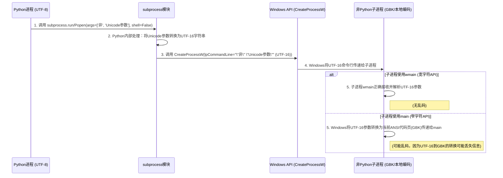
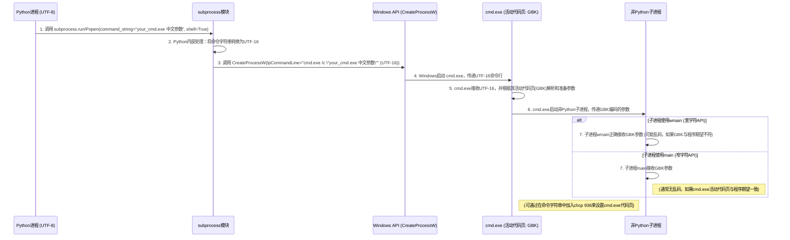

# Python Subprocess 启动子进程编码问题研究

## 引言

本研究旨在探讨在 Windows 环境下，Python 的 `subprocess` 模块在启动非 Python 子进程时，如何处理 Unicode 字符串导致的编码问题，特别是当 Python 运行在 UTF-8 环境而子进程默认使用 GBK（或其他本地编码）时出现的乱码情况。

## 问题核心

Python 3 默认使用 Unicode (UTF-8) 处理字符串，而在 Windows 系统中，许多旧版或非 Unicode 敏感的程序在命令行参数和标准 I/O 流中可能默认使用系统本地编码（例如简体中文 Windows 上的 GBK/CP936）。这种编码不匹配是导致乱码问题的根源。

主要分为两个方面的问题：
1.  **标准 I/O (stdin, stdout, stderr) 乱码**：当 Python 程序与子进程通过标准输入/输出流交换数据时，如果编码不一致，会导致读取或写入的字符出现乱码。
2.  **命令行参数 (args) 乱码**：当 Python 将包含 Unicode 字符的参数传递给子进程时，如果子进程无法正确解析这些 Unicode 参数，也会导致乱码。

## Python `subprocess` 模块行为

从 Python 3.6 版本开始，得益于 PEP 528 (Windows console encoding) 和 PEP 529 (Change Windows filesystem encoding to UTF-8) 等改进，Python 在 Windows 平台上的 Unicode 支持得到了显著增强。

*   **标准 I/O (stdin, stdout, stderr) 处理**：
    *   `subprocess.run()` 和 `subprocess.Popen()` 的 `text=True` (或 `universal_newlines=True`) 参数会将子进程的 I/O 流转换为文本模式。
    *   此时，您可以使用 `encoding` 参数明确指定子进程输入/输出流的预期编码（例如 `'gbk'`）。Python 会负责在内部进行字节流和 Unicode 字符串之间的正确编解码。
    *   **示例**：
        ```python
        import subprocess

        # 假设 your_non_python_command 输出 GBK 编码
        try:
            result = subprocess.run(
                ['your_non_python_command.exe', 'some_arg'],
                capture_output=True,
                text=True,  # 启用文本模式
                encoding='gbk', # 指定子进程输出的编码
                check=True
            )
            print("标准输出：", result.stdout)
        except subprocess.CalledProcessError as e:
            print(f"命令执行失败，错误码：{e.returncode}")
            print(f"标准输出：{e.stdout}")
        ```

*   **命令行参数 (args) 传递**：
    *   当在 `args` 中传入 Unicode 字符串时，Python 3.6+ 会在内部调用 Windows 原生宽字符 API (如 `CreateProcessW`) 来启动子进程并传递命令行参数。这意味着 Python 端已经以 UTF-16 Unicode 的形式将参数发送给了操作系统。
    *   **问题的症结通常在于**：被调用的非 Python 子进程本身没有使用 Windows 的宽字符 API (例如 `wmain` 或 `GetCommandLineW`) 来获取和解析命令行参数，而是使用了传统的窄字符 API (例如 `main` 或 `GetCommandLineA`)。在这种情况下，Windows 操作系统会将传递给它的 Unicode 命令行字符串转换成系统当前的 ANSI 代码页（如 GBK）字节流，如果转换过程中出现无法映射的字符，就会导致乱码。

## 解决方案

### 1. 标准 I/O 的解决方案

如上所述，在 `subprocess` 调用中正确使用 `text=True` 和 `encoding='...'` 参数是解决标准 I/O 乱码的关键。

### 2. 命令行参数 (args) 的解决方案

为了更好地理解 `subprocess` 在 Windows 下如何处理命令行参数的编码问题，我们通过以下时序图来可视化参数传递的流程和字符集控制要素。

#### `shell=False` 时的参数传递流程



#### `shell=True` 时的参数传递流程



针对 `args` 乱码问题，没有一个广泛使用的第三方 Python 库能够“神奇地”解决非 Unicode 敏感子进程的问题，因为问题的根源在于子进程的实现。以下是推荐的解决方案：

#### a. 首选方案：修改非 Python 子进程（如果可行）

*   **最根本、最健壮的解决方案**是修改您调用的非 Python 程序，使其能够原生处理 Unicode 命令行参数。
*   对于 C/C++ 程序，这意味着使用 `wmain(int argc, wchar_t *argv[])` 作为程序入口点，并使用 `wchar_t` 类型的字符串来处理命令行参数。

#### b. 实用方案：通过 `cmd` 脚本包装命令

如果无法修改非 Python 子进程，通过一个简单的 `cmd` 脚本作为中间层来调整编码是一个非常实用且有效的方法。

*   **原理**：
    *   Python 会使用 `CreateProcessW` 将 Unicode 命令行参数传递给 `cmd.exe`。
    *   `cmd.exe` 能够正确接收这些 Unicode 参数。
    *   在 `cmd` 脚本中，使用 `chcp` 命令将当前命令行会话的代码页设置为目标子进程所期望的编码（例如 GBK）。
    *   `cmd.exe` 在执行后续命令（即您的非 Python 程序）时，会根据其当前的活动代码页来解释并传递参数。

*   **`cmd` 包装脚本 (`run_with_gbk_args.cmd`) 示例**：
    ```cmd
    @echo off
    rem 设置当前命令行会话的代码页为 GBK (简体中文)
    rem 936 是简体中文的 GBK 代码页，也可以是 950 (繁体中文)
    chcp 936 > nul

    rem 您的非 Python 程序路径和名称
    rem %* 会把所有传递给这个脚本的参数原样转发给 YourNonPythonProgram.exe
    YourNonPythonProgram.exe %*
    ```

*   **Python 调用 `cmd` 脚本示例**：
    ```python
    import subprocess
    import os

    cmd_script_name = "run_with_gbk_args.cmd"
    unicode_args = ["第一个参数", "中文参数", "第三个参数"]

    try:
        # Python 将 Unicode 参数传递给 cmd.exe
        command = [cmd_script_name] + unicode_args

        result = subprocess.run(
            command,
            capture_output=True,
            text=True, # 启用文本模式，用于解码子进程的标准输出/错误
            encoding='gbk', # 假设 YourNonPythonProgram.exe 的输出也是 GBK
            check=True
        )
        print("标准输出：", result.stdout)
        if result.stderr:
            print("标准错误：", result.stderr)

    except subprocess.CalledProcessError as e:
        print(f"命令执行失败，错误码：{e.returncode}")
        print(f"标准输出：{e.stdout}")
        print(f"标准错误：{e.stderr}")
    except FileNotFoundError:
        print(f"错误：未找到命令或脚本 '{cmd_script_name}'。")
    except Exception as e:
        print(f"发生未知错误：{e}")
    ```

*   **方案优缺点**：
    *   **优点**：有效解决非 Unicode 敏感程序的 `args` 乱码问题；无需修改目标子进程；实现相对简单。
    *   **缺点**：增加了对 `cmd.exe` 的依赖；需要注意参数中的特殊字符和潜在的命令注入风险（尽管 `subprocess` 列表形式的 `args` 会缓解此问题）。

#### c. 使用 `shell=True` 并结合 `cmd.exe` 的行为

在某些情况下，当被调用的非 Python 程序不直接支持 Unicode 命令行参数，且无法通过修改程序本身来解决时，可以利用 `subprocess` 的 `shell=True` 参数。

*   **重要提示：当 `shell=True` 时，`args` 参数（或直接传入的第一个位置参数）必须是一个字符串，而不是字符串列表。** `subprocess` 会将这个字符串传递给 shell 来执行。

*   **原理**：
    *   当 `shell=True` 时，Python 不会直接执行目标程序，而是通过 `cmd.exe` 来执行命令。其等价的命令行调用通常是 `cmd.exe /c "你的程序及参数"`。
    *   **COMSPEC 环境变量**：在 Windows 上，`subprocess` 在 `shell=True` 时会查找 `COMSPEC` 环境变量来确定要使用的命令解释器（通常是 `cmd.exe`）。Python 会将完整的命令字符串（包括程序名和所有参数）作为单个 Unicode 字符串传递给该解释器。
    *   **`cmd.exe /c` 不直接控制字符集**：`cmd.exe /c` 命令本身没有直接控制执行脚本字符集的参数。它依赖于其自身的活动代码页来解释命令字符串并传递给子进程。因此，若要确保参数编码正确，通常需要在 `cmd.exe` 会话内部（例如通过 `chcp` 命令）来设置或确认正确的代码页。
    *   `cmd.exe` 能够接收并正确解析这个 Unicode 字符串。
    *   **关键点**：`cmd.exe` 在执行被包装的命令时，会根据其**当前的活动代码页**来解释和传递参数给目标程序。如果 `cmd.exe` 的代码页与目标程序期望的编码一致（例如，都是 GBK），则可以避免乱码。
    *   这种方法与上述“通过 `cmd` 脚本包装命令”的原理类似，因为它实际上是让 `cmd.exe` 承担了中间编码转换和参数传递的角色。
    *   通常，可以通过在 Python 中设置 `os.environ['COMSPEC']` 为一个包含 `chcp` 命令的临时 `cmd` 脚本，或者直接在 `args` 中构建包含 `chcp` 的命令字符串（但这会使 `args` 变得复杂，且不推荐），来间接控制 `cmd.exe` 的代码页。然而，更推荐的方法是直接使用上述的**外部 `cmd` 包装脚本**，因为它更清晰且易于维护。

*   **示例 (简化概念，不推荐直接在Python中构建复杂命令行)**：
    ```python
    import subprocess
    import os

    # 假设你的非 Python 程序 YourNonPythonProgram.exe 期望 GBK 编码的参数
    # 并且 cmd.exe 的当前活动代码页被设置为 GBK
    unicode_arg = "中文参数"

    try:
        # 当 shell=True 时，subprocess 会将命令字符串传递给 cmd.exe /c "..." 执行
        # 这要求参数本身在 cmd.exe 环境下能够被正确解释
        command_string = f"YourNonPythonProgram.exe {unicode_arg}"

        result = subprocess.run(
            command_string, # 这里必须是字符串，而不是列表
            shell=True,
            capture_output=True,
            text=True, # 启用文本模式
            encoding='gbk', # 假设 YourNonPythonProgram.exe 的输出也是 GBK
            check=True
        )
        print("标准输出：", result.stdout)
        if result.stderr:
            print("标准错误：", result.stderr)
	    except subprocess.CalledProcessError as e:
        print(f"命令执行失败，错误码：{e.returncode}")
        print(f"标准输出：{e.stdout}")
        print(f"标准错误：{e.stderr}")
    except FileNotFoundError:
        print("错误：未找到命令。")
    except Exception as e:
        print(f"发生未知错误：{e}")
    ```

*   **优点与缺点**：
    *   **优点**：对于一些简单场景，可以快速实现，无需额外文件。
    *   **缺点**：
        *   **安全性风险**：`shell=True` 存在命令注入的风险，尤其是在参数来源于外部输入时，必须谨慎处理参数的引用和转义。
        *   **平台依赖性**：命令字符串的构建和转义规则会因操作系统和 shell 的不同而异。
        *   **难以调试**：当命令复杂或包含特殊字符时，排查问题变得困难。
        *   **不透明性**：Python 不再直接控制参数的传递，而是依赖于 `cmd.exe` 的行为，降低了控制力。
        *   **推荐**：通常情况下，**不推荐使用 `shell=True`**，除非您明确知道其风险并能妥善处理，或者在别无选择的情况下。优先考虑使用列表形式的 `args` (即 `shell=False`) 来避免命令注入风险，并通过上述的 `cmd` 脚本包装方式来解决编码问题。

#### d. `shell=True` 与 `shell=False` 结合 `cmd.exe /c` 的行为对比

虽然 `shell=True` 在 Windows 上最终也是通过 `cmd.exe /c` 来实现，但两者在行为和安全性方面存在显著差异。理解这些差异对于正确选择 `subprocess` 的使用方式至关重要。

| 特性             | `shell=True` (`subprocess.run("cmd string", shell=True)`) | `shell=False` 结合 `cmd.exe /c` (`subprocess.run(['cmd.exe', '/c', 'cmd string'], shell=False)`) |
| :--------------- | :--------------------------------------------------------- | :------------------------------------------------------------------------------------------------- |
| **Python内部处理** | Python 自动将命令字符串包装成 `cmd.exe /c "..."`，并尝试进行转义。 | 您手动构造 `['cmd.exe', '/c', 'cmd string']` 列表，其中 `'cmd string'` 必须是一个单一的字符串（而非列表），对该字符串的引用和转义拥有完全控制权。 |
| **参数解析责任** | Python 承担部分转义责任，但对于复杂命令可能不完美。       | 您需要手动负责 `cmd string` 中所有参数的引用和转义，以确保 `cmd.exe` 正确解析。 |
| **安全性**       | 存在更高的命令注入风险，尤其当命令字符串来源于外部输入时。 | 相对于 `shell=True` 更安全，但仍需确保 `cmd string` 内部的命令是安全的。 |
| **适用场景**     | 简单命令，或确实需要 Shell 特性但对安全性要求不那么严格的场景。 | 需要精确控制命令字符串，或安全性要求较高的场景。 |
| **平台独立性**   | 理论上更具平台独立性，但实际受限于不同 Shell 语法。         | 明确指定 `cmd.exe`，Windows 特有行为。如果需要跨平台，需额外逻辑判断。 |

**核心建议**：对于大多数情况，优先使用 `shell=False` 并传入字符串列表作为 `args`。如果确实需要 Shell 特性，且能严格控制命令字符串的构造和所有参数的引用/转义，那么显式地使用 `shell=False` 结合 `['cmd.exe', '/c', '您的命令和参数']` 是一种更可控、更清晰的方式。

#### e. 不推荐的 Python 端显式编码技巧

一种不推荐但有时可能被考虑的“hacky”方法是在 Python 端显式地将 Unicode 参数编码为子进程期望的字节流，然后通过某种方式传递。例如，将编码后的字节串再解码为 `'latin-1'` 字符串传递给 `subprocess`。这种方法高度依赖于 Windows API 的底层行为，兼容性差，且难以维护，**强烈不推荐在生产环境中使用**。

#### f. 命令行参数转义工具

在手动构造命令字符串（尤其是当 `shell=True` 或使用 `cmd.exe /c` 且命令字符串包含复杂参数时）时，正确地转义参数至关重要，以避免命令注入漏洞和解析错误。

*   **Python 内置的 `shlex` 模块：**
    *   `shlex` 模块是 Python 标准库中用于简单的词法分析（lexer）的工具，其 `quote()` 函数旨在为 Shell 命令字符串中的参数提供转义。
    *   **重要提示：`shlex` 模块主要为 Unix Shell 设计**。其官方文档明确指出，`shlex.quote()` **不保证在非 POSIX 兼容的 Shell 或其他操作系统（如 Windows）上是正确的**。在 Windows `cmd.exe` 上使用 `shlex.quote()` 进行转义可能会导致**命令注入漏洞**或参数解析错误。
    *   **结论：不应使用 `shlex.quote()` 来转义 Windows `cmd.exe` 的命令行参数。**

*   **第三方库 `mslex`：**
    *   由于 `shlex` 不适用于 Windows，社区开发了一个专门用于 Windows 命令行的第三方库：[`mslex`](https://github.com/smoofra/mslex)。
    *   `mslex` 旨在提供类似 `shlex` 的功能（`split`, `quote`, `join`），但专门针对 Windows Shell 的复杂引用规则进行设计。它能够生成被 Windows C 运行时（包括现代版本和旧版 `msvcrt.dll`）正确解析的引用字符串。
    *   **推荐**：如果您需要在 Python 代码中动态构造包含复杂或用户输入参数的 Windows 命令行字符串，并确保其被 `cmd.exe` 正确安全地解析，`mslex.quote()` 是一个值得考虑的工具。
    *   **安装**：`pip install mslex`
    *   **示例**：
        ```python
        import subprocess
        from mslex import quote # 假设已安装 mslex

        user_input = "dir; del /q C:\\important_file.txt" # 模拟恶意用户输入
        safe_arg = quote(user_input)

        # 构造用于 cmd.exe /c 的命令字符串
        command_string = f"echo {safe_arg}"

        try:
            result = subprocess.run(
                ['cmd.exe', '/c', command_string],
                capture_output=True,
                text=True,
                check=True
            )
            print("标准输出：", result.stdout)
        except subprocess.CalledProcessError as e:
            print(f"命令执行失败，错误码：{e.returncode}")
            print(f"标准输出：{e.stdout}")
            print(f"标准错误：{e.stderr}")
        ```
    *   **注意**：尽管 `mslex` 提供了更好的转义，但最佳实践仍然是尽可能使用 `shell=False` 并传入字符串列表，避免手动构造复杂的命令字符串，因为这从根本上减少了转义的复杂性和命令注入的风险。

*   **其他考量：`oslex`**
    *   `oslex` 是一个轻量级库，它在 Windows 上自动使用 `mslex`，在其他操作系统上使用 `shlex`。这有助于编写更具平台兼容性的代码。

## 环境因素（辅助手段）

除了上述直接解决编码问题的方法，以下环境设置也可以作为辅助手段，有助于在 Windows 环境下保持编码的一致性：

*   **设置 Windows 控制台编码**：
    *   在 Windows 命令提示符中，可以使用 `chcp 65001` 命令将控制台的活动代码页设置为 UTF-8。这有助于确保控制台本身能够正确显示 Unicode 字符。
*   **设置 `PYTHONIOENCODING` 环境变量**：
    *   将系统或用户环境变量 `PYTHONIOENCODING` 设置为 `utf-8`。这会强制 Python 解释器在标准 I/O (`sys.stdin`, `sys.stdout`, `sys.stderr`) 中使用 UTF-8，有助于整个 Python 应用程序的编码一致性。

## 总结

对于 Python 3.11 中 `subprocess` 启动子进程时的编码问题，关键在于识别 Python 程序内部的 UTF-8 编码与非 Python 子进程所期望的本地编码（通常是 GBK）之间的差异。解决方案不在于寻找额外的第三方库，而在于：

1.  **对于标准 I/O**：在 `subprocess` 调用中，结合 `text=True` 和 `encoding` 参数进行明确的编解码控制。
2.  **对于命令行参数 (`args`)**：
    *   **最佳实践是改造非 Python 子进程**使其原生支持 Unicode 参数。
    *   **如果无法改造，使用 `cmd` 包装脚本**是一个实用且有效的替代方案，通过 `chcp` 命令为子进程设置正确的代码页环境。

理解这些原理和方法，将能有效解决在 Windows 下 Python `subprocess` 启动子进程时遇到的 Unicode 乱码问题。
